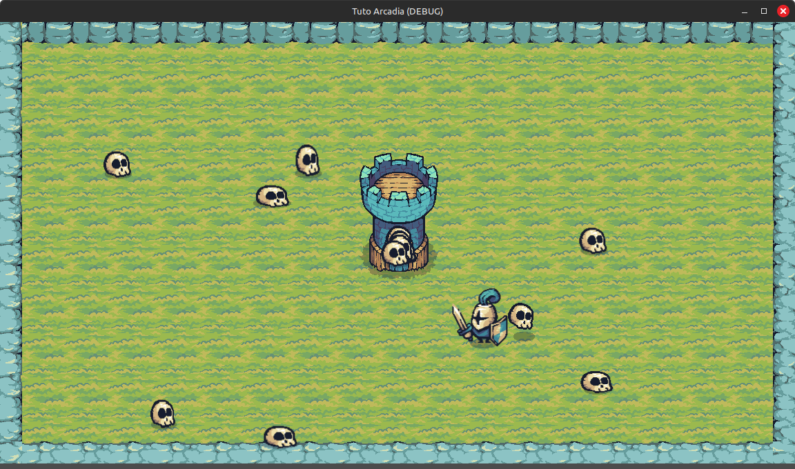
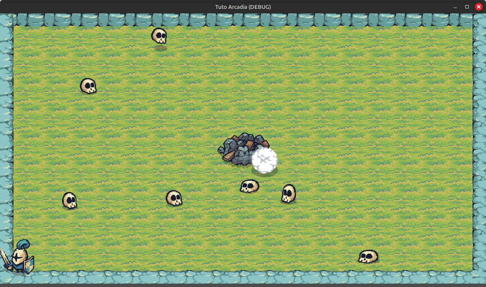

Création des ennemis
====================

Okay! C'est pas mal, mais notre monde est un peu vide. Peuplons-le avec des ennemis!

.. image:: img/preview.gif

Création des ennemis
--------------------

Créez une nouvelle scène avec un nœud ``Area2D``.

.. note::
    Les ``Area2D`` sont des nœuds utilisés pour détecter des collisions. À contrario des ``CharacterBody2D`` et ``StaticBody2D``, les ``Area2D`` ne sont pas utilisées pour
    des collisions physiques (des trucs qui se cognent entre eux et qui ne peuvent pas se traverser).
    Les ``Area2D`` détectent d'autres objets avec des collisions lorsque ceux-ci rentrent à l'intérieur de la collision de l'``Area2D`` (un peu comme un radar).

On utilise une ``Area2D`` pour les ennemis pour plusieurs raisons.

Premièrement, on souhaite détecter le contact entre un ennemi et le joueur. Lorsque le joueur rentre dans la collision de l'ennemi, ce dernier meurt.
Comme vous pouvez le voir sur le gif de présentation, les ennemis et le joueur ne collisionnent pas entre eux, pas comme le joueur et la tour par exemple.

Deuxièmement, on souhaite détecter le contact entre un ennemi et la tour. Lorsqu'un ennemi entre en collision avec la tour, il meurt, et fait des dégâts à la tour
(en appellant la fonction ``damage()`` de la tour que l'on a écrite plus tôt). De même, on ne veut pas que l'ennemi ne puisse pas traverser la tour.

Renommez ce nœud ``"Enemy"``, sauvegardez la scène ``enemy.tscn``. Comme d'habitude, ajoutez un ``AnimatedSprite2D`` et une ``CollisionShape2D`` à l'ennemi.

Les animations
~~~~~~~~~~~~~~

Ajoutez un ``SpriteFrames`` à l'``AnimatedSprite2D``. Les animations des ennemis seront un peu plus fournies que les précédentes.
Nous allons créer 4 animations: ``"spawn"``, ``"run"``, ``"explode"``, et ``"die"``.

-   L'animation ``"spawn"`` se jouera lorsque l'ennemi apparaîtra (spawn).
-   L'animation ``"run"`` se jouera lorsque l'ennemi se déplacera vers la tour.
-   L'animation ``"explode"`` se jouera lorsque l'ennemi entrera en contact avec la tour (il explose la tour).
-   L'animation ``"die"`` se jouera lorsque le joueur entrera en contact avec un ennemi (le joueur tue l'ennemi).

Les animations auront les frames suivantes:

-   Dans l'animation ``"spawn"``, cliquez sur **Add frames from sprite sheet**, et sélectionnez le fichier ``assets/enemies/skull_enemy.png``.
    Réglez la taille de la spritesheet, on a 7 colonnes et 2 lignes. Puis sélectionnez les 3 premières frames. Vous pouvez jouer cette animation à **8 FPS**.
-   Pour l'animation ``"run"``, faites la même chose en sélectionnant les frames 4 à 10.
-   Pour l'animation ``"die"``, de même, en prenant les 4 dernières frames.
-   Pour l'animation ``"explode"``, vous pouvez prendre le fichier ``assets/enemies/Explosions.png`` et y ajouter les 9 frames. Vous pouvez jouer celle-ci à **12 FPS**.

Activez l'**Animation Looping** sur l'animation ``"run"``, comme on avait fait avec le joueur, afin que cette animation puissent boucler.

La collision
~~~~~~~~~~~~

Ajoutez une ``CircleShape2D`` à la ``CollisionShape2D`` de votre ennemi. Mettez un rayon de ``16px`` et descendez-la un peu pour obtenir ce résultat:

Le script
---------

Ok, on a les bases, maintenant il est temps d'ajouter un comportement à notre ennemi.

Ajoutez un script sur votre ennemi: ``enemy.gd``. Le comportement de notre ennemi est assez simple:
-   Il spawn
-   Il va tout droit vers la tour
-   S'il touche la tour, il explose et fait des dégâts
-   S'il touche le joueur, il meurt

Initialisation
~~~~~~~~~~~~~~

Commençons par créer plusieurs variables:

.. code:: gdscript

    extends Area2D

    @export var speed = 50.0 # Vitesse de l'ennemi
    @export var acceleration = 10.0 # Acceleration, pour avoir un mouvement plus smooth

    var velocity: Vector2 # Vecteur de mouvement de l'ennemi, qui sera actualisé chaque frame
    var target: Vector2 = Vector2.ZERO # Position de la cible de l'ennemi (pour nous, la tour)

Pour les fonctions, commençons par le commencement, l'éternelle fonction ``_ready()``:

.. code:: gdscript

    func _ready() -> void:
        # Dès que l'ennemi apparaît, on joue l'animation de spawn
        $AnimatedSprite2D.play("spawn")

Ensuite, on veut que dès que l'animation de spawn soit terminée, l'ennemi se dirige vers la tour.
Pour détecter lorsqu'une animation se termine, il faut utiliser le signal ``animation_finished`` de l'``AnimatedSprite2D``.

Pour cela, allez dans l'onglet **Node**, du côté de l'Inspecteur de l'``AnimatedSprite2D``, et connectez le signal au nœud ``Enemy``.
Cela va créer la fonction ``_on_animated_sprite_2d_animation_finished()`` dans le script de l'ennemi.
Cette fonction sera appelée à chaque fois que l'``AnimatedSprite2D`` termine une animation.

.. warning::
    Les animations qui bouclent, comme l'animation ``"run"``, n'émettent pas le signal ``animation_finished``, mais le signal ``animation_looped``.
    Ici, faites bien attention à ce que les 3 autres animations ne bouclent pas, car sinon elles n'appeleront pas la fonction.

On va donc ajouter le code suivant au script:

.. code:: gdscript

    func _on_animated_sprite_2d_animation_finished():
        # Si l'animation spawn se termine, on joue l'animation run
        if $AnimatedSprite2D.animation == "spawn":
            $AnimatedSprite2D.play("run")

.. note::
    Faites bien attention à ce que le signal ``animation_finished`` soit connecté correctement!

Mouvements
~~~~~~~~~~

Bon c'est cool, mais notre ennemi ne se déplace pas.
Pour ça, on va faire en sorte que dès qu'il est dans l'animation ``"run"``, il se dirige vers sa cible, le point ``target``.

On va utiliser la fonction ``_physics_process``, comme pour le joueur:

.. code:: gdscript

    func _physics_process(delta: float) -> void:
        # Si l'ennemi run, il se déplace vers sa cible
        if $AnimatedSprite2D.animation == "run":
            # La direction pointe de l'ennemi jusqu'à sa cible
            var direction = (target - global_position).normalized()
            # On change velocity, comme avec le joueur
            velocity = lerp(velocity, direction * speed, delta * acceleration)
            # On change la direction du sprite de l'ennemi, si celui-ci change de direction
            if direction.x < 0:
                $AnimatedSprite2D.flip_h = true
            elif direction.x > 0:
                $AnimatedSprite2D.flip_h = false
            # On change la position
            position = position + velocity * delta

Si vous vous souvenez, dans le script du joueur, on modifiais la vélocité, puis on appelais la méthode ``move_and_slide()``.
En fait, l'attribut ``velocity`` et la méthode ``move_and_slide()`` appartiennent à la classe ``CharacterBody2D`` que l'on utilisait pour le joueur.
On n'avait qu'à modifier la vélocité, et la méthode faisait le reste du travail à notre place.

Ici, l'ennemi est un ``Area2D``, il n'a donc pas ces attributs et méthodes.
C'est pour ça qu'on a créé nous même la variable ``velocity``, qui a exactement la même utilité que pour le joueur.
On n'a pas la méthode ``move_and_slide()`` malheureusement, donc on doit nous même changer la position de l'ennemi. C'est ce qu'on fait à la dernière ligne de la fonction.

Si vous avez fait un peu de physique, cette dernière ligne pourrait être réécrite comme ça:

.. math::
    \begin{align*}
        x_{t+1} &= x_t + v_t * \Delta t \\
        \text{nouvelle position} &= \text{ancienne position} + \text{vitesse} * \text{delta} \\
        \text{ou:} \quad x_{t+1} &= x_t + \frac{d x}{d t} * d t
    \end{align*}

Et bien sûr on n'oublie pas de changer le sens du sprite de l'ennemi selon sa direction, comme on avait fait pour le joueur.

Ok! Si vous changez la valeur de ``target``, par exemple en mettant ``Vector2(500, 500)``, et que vous lancez votre scène ennemi, vous verrez normalement
qu'il spawn, puit commence à se déplacer vers le point *(500,500)*, puis s'arrête.

Ajoutons les ennemis à notre monde, et voyons comment tout ça se comporte.

Spawnage des ennemis
--------------------

Voilà comment on va faire spawn les ennemis:
Il y a un timer qui va se lancer toutes les secondes. À chaque fois que ce timer termine, on va faire spawn un ennemi.
Pour choisir la position de l'ennemi, il existe plusieurs manières possibles. On souhaite que nos ennemis spawnent uniquement au bord de la map.
On va donc créer un chemin (un path) qui va faire le tour de la map, et les ennemis spawneront à un endroit aléatoire sur ce path.

Revenons à notre scène ``World``. Contrairement au joueur et à la tour, nous n'allons pas ajouter les ennemis manuellement à la scène.
Tout simplement parce que les ennemis apparaissent en continu, et donc qu'on ne peut pas prévoir leur nombre à l'avance.
On va donc les ajouter grâce à un script.

Initialisation du script
~~~~~~~~~~~~~~~~~~~~~~~~

Ajoutez un script au nœud ``World``, c'est là qu'on va gérer le spawn des ennemis, ainsi que d'autres choses que l'on verra plus tard.

Ajoutons tout de suite une variable:

.. code:: gdscript

    extends Node2D

    # Variable qui va contenir la scène enemy.tscn
    @export var enemy: PackedScene

Dans l'Inspecteur, vous verrez la variable Enemy qui est vide. Ajoutez la scène enemy.tscn à l'intérieur, soit en cliquant sur **Load** ou **Quick Load**,
ou en allant chercher la scène dans le projet en bas à gauche, et en la glissant dans la variable.

À chaque fois que l'on fera spawner un ennemi, on créera une nouvelle instance de cette scène.

Le path
~~~~~~~

Créons d'abord le path sur lequel les ennemis apparaîtront. Pour cela, ajoutez un nœud ``Path2D`` en enfant de ``World`` et renommez-le ``EnemyPath``.

Ajoutez un ``Curve2D`` pour ajouter un chemin. Pour tracer le chemin, il faut y ajouter des points. Pour ce faire, appuyez sur l'icône **Add Point** en haut.
Pour ajouter un point, il suffit de cliquer quelque part. Faites attention à être en **Select Mode** (en haut à gauche).

Cliquez dans les 4 coins du terrain pour créer le chemin, et cliquez sur l'icône **Close Curve** en haut, pour fermer la courbe et rejoindre le premier point.

Vous pouvez changer la position des points soit à la main en cliquant sur l'icône **Select Points** en haut, ou en accédant directement à la liste des points
dans l'Inspecteur en cliquant sur la ``Curve2D``, dans le sous-onglet **Points**.

Pour choisir une position exacte sur ce Path, il faut ajouter un nœud ``PathFollow2D`` en enfant de ce path. Vous pouvez le renommer ``EnemySpawnPosition``.
En changeant l'attribut **Progress** ou **Progress Ratio** dans l'Inspecteur, vous verrez le nœud se déplacer sur le path.

L'attribut **Progress Ratio** est plus pratique, car il représente un pourcentage. À 0, le ``PathFollow2D`` se trouve au début du ``Path2D``.
À 0.5, il se trouve à la moitié, et à 1, il se trouve à la fin.
Pour générer une position aléatoire sur le ``Path2D``, on va donc générer un nombre aléatoire entre 0 et 1,
mettre le progress ratio du ``PathFollow2D`` à cette valeur, et récupérer la position globale du ``PathFollow2D``.

Le timer
~~~~~~~~

Ajoutez donc un nœud ``Timer`` en enfant de ``World``, que vous allez renommer ``EnemySpawnTimer``.
Mettez son **Wait Time** à 1s (c'est-à-dire le temps que le chronomètre va durer),
et activez **Autoload**, pour qu'il se lance dès que la scène commence, sans qu'on ait besoin de l'activer via un script.

Dans l'onglet **Node**, connectez le signal ``timeout`` au script de ``World``.
Ce signal est émit à chaque fois que le timer a fini, donc pour nous, toutes les secondes.

On va maintenant ajouter le comportement du spawn des ennemis dans la fonction ``_on_enemy_spawn_timer_timeout()`` qui vient d'être créée:

.. code:: gdscript

    func _on_enemy_spawn_timer_timeout():
        # On crée un mob, qui est une instance de la scène enemy.tscn
        var mob = enemy.instantiate() 
        
        # On choisit un progress_ratio aléatoire, et on récupère la position du PathFollow2D
        var mob_spawn_location = $EnemyPath/EnemySpawnPosition
        mob_spawn_location.progress_ratio = randf() # Génère un nombre aléatoire entre 0 et 1
        mob.position = mob_spawn_location.position
        
        # On change la cible de l'ennemi, pour qu'il aille vers la tour
        mob.target = $Tower.global_position
        
        # On ajoute l'ennemi à la scène, pour que celui-ci apparaisse
        add_child(mob)

Vous pouvez lancer le jeu, et constater que les enemis spawnent correctement!
Bon par contre... on peut pas interagir avec, et ils s'accumulent sur la tour...

Interactions
------------

Revenez sur la scène ``Enemy``.
On le rappelle, l'ennemi a deux interactions:

-   S'il touche la tour, il explose et celle-ci prend des dégâts
-   S'il touche le joueur, il meurt

Il nous faut donc un moyen de détecter les collisions avec d'autres corps. Ça tombe bien, l'``Area2D`` est fait pour ça.
Connectez donc le signal ``body_entered`` du nœud ``Enemy`` à son propre script.

.. note::
    Le signal ``body_entered`` de l'``Area2D`` est émit lorsque celle-ci entre en collision avec un ``PhysicsBody2D``, une classe abstraite
    dont le ``CharacterBody2D`` et le ``StaticBody2D`` font partie, mais pas l'``Area2D``.

Ici, l'utilisation de ce signal est parfaite, puisqu'on souhaite pouvoir détecter le joueur (``CharacterBody2D``), et la tour (``StaticBody2D``),
mais pas les ennemis (``Area2D``).

Voici la fonction à rajouter dans le script de l'ennemi.

.. code:: gdscript

    # L'argument body renvoie le corps avec qui il y a eu une collision
    func _on_body_entered(body):
        # Si le corps est un joueur, on joue l'animation de mort de l'ennemi
        if body.name == "Player":
            $AnimatedSprite2D.animation = "die"
            
        # Si le corps est une tour
        if body.name == "Tower":
            # On joue l'animation d'explosion de l'ennemi
            $AnimatedSprite2D.animation = "explode"
            # On dit à la tour de prendre des dégats
            body.damage()

Donc si on touche le joueur, l'ennemi meurt. Et si on touche la tour, l'ennemi explose et la tour prend des dégâts.
Notez que la fonction ``damage()`` qui est appelée ici est celle que l'on avait créée dans le script de la tour.

Vous pouvez tester le jeu. C'est pas mal, les ennemis répondent bien et la tour se détruit au bout de quelques coups.
Mais les enemis ne disparaissent pas vraiment...

Cela est dû au fait qu'on ne fait pas disparaître les ennemis. On leur dit de jouer une animation, mais c'est tout.
On souhaiterai qu'à la fin des animations ``"die"`` et ``"explode"``, ils disparaissent.
Ça tombe bien, on a un moyen de détecter la fin de ces animations, car on a déjà connecté le signal ``animation_finished``, et on a déjà la fonction correspondante.

Dans la fonction ``_on_animated_sprite_2d_animation_finished()``, ajoutez:

.. code:: gdscript
    
    func _on_animated_sprite_2d_animation_finished():
        # [...] Logique de l'animation de spawn

        if $AnimatedSprite2D.animation == "die" or $AnimatedSprite2D.animation == "explode":
            queue_free()

.. note::
    La méthode ``queue_free()``, disponible sur absolument tous les nœuds, permet de détruire un nœud, et donc de l'enlever de la scène.

Bon c'est cool! Maintenant les ennemis fonctionnent parfaitement!
Bon par contre... une fois que la tour est détruite, il ne se passe plus grand chose... il ne reste qu'une horde d'ennemis kamikaze et un joueur seul et triste.

Changeons tout ça dans la prochaine partie!
