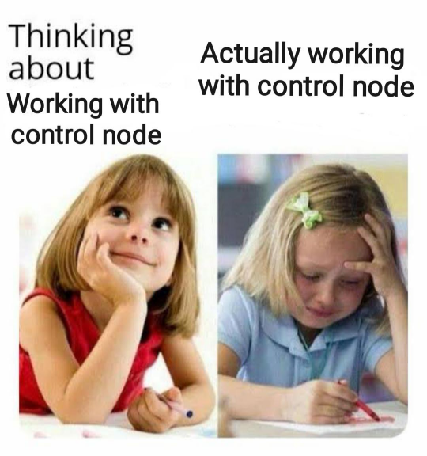

Création de l'interface
=======================

Dans cette partie, on va terminer le jeu. Il nous manque une petite barre de vie pour indiquer au joueur à combien de coups la tour peut encore résister.
Il manque aussi un menu principal, sur lequel on doit revenir quand la partie s'arrête.

Les interfaces dans Godot
-------------------------

Pour créer des interfaces dans Godot, on utilise des nœuds ``Control``. Ce sont les nœuds qui ont un icône vert (là où les nœuds 2D ont un icône bleu et les 3D un icône rouge).
Voici un petit résumé de comment se passe une situation normale lorsqu'on travaille avec des Control nodes:

Pour mieux comprendre comment ça fonctionne, il est FORTEMENT conseillé de regarder `cette magnifique vidéo <https://youtu.be/5Hog6a0EYa0?si=xOQb3F4YNDsQqQ6z>`_
(en anglais mais il y a beaucoup d'aides visuelles).

La barre de vie
---------------

