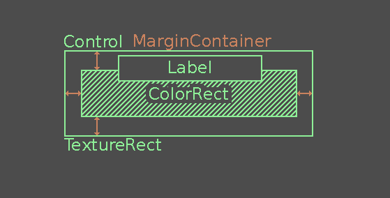

Création de l'interface
=======================

Dans cette partie, on va terminer le jeu. Il nous manque une petite barre de vie pour indiquer au joueur à combien de coups la tour peut encore résister.
Il manque aussi un menu principal, sur lequel on doit revenir quand la partie s'arrête.

Les interfaces dans Godot
-------------------------

Pour créer des interfaces dans Godot, on utilise des nœuds ``Control``. Ce sont les nœuds qui ont un icône vert (là où les nœuds 2D ont un icône bleu et les 3D un icône rouge).
Voici un petit résumé de comment se passe une situation normale lorsqu'on travaille avec des Control nodes:

.. image:: img/controlnodememe.png

Pour mieux comprendre comment ça fonctionne, il est FORTEMENT conseillé de regarder `cette magnifique vidéo <https://youtu.be/5Hog6a0EYa0?si=xOQb3F4YNDsQqQ6z>`_
(en anglais mais il y a beaucoup d'aides visuelles).

La barre de vie
---------------

Voici la barre de vie que l'on va recréer ici:

Il existe bien sûr plusieurs méthodes différentes pour arriver au même résultats, mais on va essayer une approche assez simple qui utilise peu de nœuds.
Déjà, on sait qu'il nous faut au moins:

-   Un nœud ``Control`` pour contenir le tout.
-   Un nœud ``TextureRect``, qui va afficher l'image de fond: ``assets/GUI/health_bar_underlayer.png``.
-   Un nœud ``ColorRect``, qui va être le rectangle de couleur indiquant le restant de vie.
-   Un nœud ``Label``, qui va afficher le texte **"Base HP:"**.

Il suffit maintenant de jouer avec les de ces nœuds pour voir comment arriver à ce résultat.

On va cependant se servir d'un nœud supplémentaire pour nous faciliter la tâche. En effet, on voit que le ``ColorRect`` ne prend pas toute la place par rapport au ``TextureRect``.
Pour ça, on va utiliser un nœud ``MarginContainer`` (avec un autre ``Control``), qui va nous permettre d'ajouter des marges autour du nœud ``ColorRect``.

Finalement, si on visualise les différents nœuds, on aura quelque chose comme ça:

Création de l'interface
~~~~~~~~~~~~~~~~~~~~~~~

On va ajouter notre barre de vie directement dans la scène ``World``. Allez-y donc, et ajoutez un nœud ``Control`` en enfant de ``World``.
Vous pouvez le renommer ``"GUI"`` pour Game User Interface.

En enfant de ce nœud, ajoutez un ``TextureRect``. Dans l'Inspecteur, ajoutez le ficheir ``assets/GUI/health_bar_underlayer.png`` dans l'attribut **texture**.
Toujours dans l'Inspecteur du ``TextureRect``, dans l'onglet **Layout -> Transform**, vous trouverez la taille de l'image utilisée.

Copiez la valeur **Size** en faisant **Clic droit -> Copy Value**, et copiez cette valeur dans l'attribut **Custom Minimum Size** du nœud ``GUI``.

Ensuite, mettez le nœud ``TextureRect`` en mode **Full Rect**, en cliquant sur l'icône en haut de l'éditeur.
Cela nous assure que le ``TextureRect`` prend bien tout l'espace du nœud ``GUI``, et c'est un peu plus clean comme ça.

Vous pouvez ensuite ajouter un ``ColorRect`` en enfant de ``GUI``. si vous le mettez lui aussi en **Full Rect**, vous verrez qu'il couvre l'entièreté de ``GUI``, et donc qu'il cache le ``TextureRect``.
C'est là que le ``MarginContainer`` entre en jeu. Ajoutez-en un en enfant de ``GUI``, mettez-le en mode **Full Rect**.
Ajoutez un nœud ``Control`` en enfant de ce ``MarginContainer`` et mettez-le aussi en **Full Rect**. Enfin, mettez le ``ColorRect`` en enfant de ce ``Control``.

.. note::
    On ajoute ici un nœud ``Control`` afin de pouvoir changer les **Anchors** du ``ColorRect``. Sans ça, le ``ColorRect`` serait un enfant direct du ``MarginContainer``,
    qui est un ``Container``. Or, on ne peut changer les propriétés de layout d'un enfant direct d'un ``Container``, c'est pourquoi on rajoute un ``Control``.

.. image:: img/whitegui.png

Bon, à priori, rien n'a changé... mais c'est normal, on n'a pas défini les marges à appliquer autour de notre nœud.
Pour faire ça, dans l'Inspecteur du ``MarginContainer``, allez dans **Theme Overrides -> Constants**, et cochez toutes les cases et mettez toutes les valeurs à 15px.

Vous devriez voir les bords du ``ColorRect`` bouger un peu, et en jouant avec les valeurs, vous pourrez comprendre davantage comment ça fonctionne.
Ok c'est pas mal, maintenant, on va juste changer la couleur du ``ColorRect``. Pour nous, c'est la couleur ``#ffbd00ae``, mais vous pouvez mettre ce que vous voulez.

C'est pas mal, on a presque fini, plus qu'à rajouter le petit texte. Pour ça, ajoutez un nœud ``Label`` en enfant de ``GUI``.
Positionnez-le en mode **Center Top**, dans le même menu que pour mettre en **Full Rect**.
Vous verrez maintenant qu'il est centré en haut du nœud ``GUI``.

Écrivez **"Base HP:"** dans l'attribut **Text** du ``Label``, puis ajoutez un **Label Settings** juste en dessous, puis complétez les paramètres comme suit,
en utilisant la police d'écriture (Font) ``assets/Fonts/Retro Gaming.ttf``:

Ok pas mal! On a notre barre de vie. Cependant, on peut observer plusieurs problèmes.
Déjà, elle ne s'actualise pas quand la tour prend des dégâts, ce qui est tout à fait normal, puisqu'on n'a pas écrit de script pour.
Le deuxième problème, c'est que les entités (le joueur, les ennemis, etc.) apparaissent au dessus de la barre de vie en jeu:

Ça fait un certain effet, mais c'est pas vraiment ce qu'on veut. Pour régler ça, vous pouvez changer le **Z Index** de ``GUI`` dans l'Inspecteur.
Vous pouvez mettre 1, 10, ou 1000, l'important c'est que ça soit plus haut que les autres éléments du jeu, pour que ça s'affiche toujours au dessus.

Finalement, votre GUI devrait ressembler à ça:

Le script
~~~~~~~~~

Le script de la barre de vie va être assez simple. Le but, c'est juste de l'actualiser lorsque la tour prend des dégâts.
Pour ça, on va utiliser le pourcentage de vie restant à la tour, qu'on a déjà évoqué lors de la création du script de la tour:

.. code:: gdscript

    func damage() -> void:
        # [...]
        is_hit.emit(health/max_health)

On va utiliser ce pourcentage de vie dans l'attribut ``anchor_right`` du ``ColorRect``.
Dans l'Inspecteur du ``ColorRect``, mettez le **Layout Mode** en **Anchors**, et changez **Anchors Preset** en **Custom**.
Si tout se passe bien, vous devriez avoir les **Anchors Points** Left, Top, Right et Bottom, respectivement à 0, 0, 1 et 1.

En changeant le Right, on observe le comportement suivant, le pourcentage de vie restante correspond exactement au pourcentage dans Anchor Right:

Pour coder ça, on va utiliser le script du nœud ``World``. Connectez le signal ``is_hit`` de la tour à ce script.
Pour changer l'Anchor Right du ColorRect, ajoutez simplement:

.. code:: gdscript

    func _on_tower_is_hit(health_percent: float) -> void:
	    $GUI/MarginContainer/Control/ColorRect.anchor_right = health_percent

En lançant le jeu, il se peut que vous ayez un comportement innatendu: la barre de vie se vide d'un seul coup.
Dans le Debugger, en bas, vous pourrez voir une notification en jaune: *"Integer division, decimal part will be discarded."*
En cliquant dessus, cela vous amène à la ligne dans la fonction ``damage()`` qui émet le signal ``is_hit``.

En fait, les variables ``health`` et ``max_health`` sont de type ``int`` (entier). En GDScript, si on divise un entier (ici ``health``), le résultat sera automatiquement un entier.
Ici, comme il s'agit d'un pourcentage, donc d'une valeur entre 0 et 1, le résultat est automatiquement arrondi à 0, et donc la barre se vide entièrement d'un coup.

Pour régler ça, vous pouvez changer le type de ``health`` en ``float`` (nombre flottant, c-à-d un nombre à virgule). Normalement, tout devrait fonctionner correctement.
