Création du Joueur
==================

Dans cette partie du tutoriel, nous allons créer un joueur, lui ajouter des animations, et des mouvements basiques.
À la fin de cette section, vous devriez avoir tout ça:

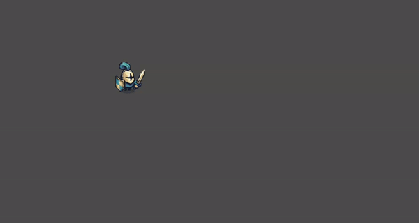

.. _init-joueur:

Initialisation du Joueur
------------------------

Pour commencer, nous allons créer un ``CharacterBody2D``. C'est un nœud 2D, qui est utilisé pour créer des personnages qui peuvent se déplacer.
En haut à gauche, dans l'arborescence des scènes, créez une nouvelle scène en cliquant sur le bouton **Other Node** ou le bouton **+**. Ajoutez un ``CharacterBody2D``.
Le noeud CharacterBody2D devrait apparaître dans l'arborescence, et l'éditeur devrait être passé en mode 2D.
Avant toute chose, sauvegardez votre nouvelle scène en appuyant sur ``Ctrl+S``.
Vous pouvez créer un dossier ``scenes`` dans votre projet, et y enregistrer la scène du joueur en l'appellant ``player.tscn``.

À droite du ``CharacterBody2D``, vous devriez appercevoir une icône de warning. Si vous placez votre souris dessus, vous verrez le message suivant:

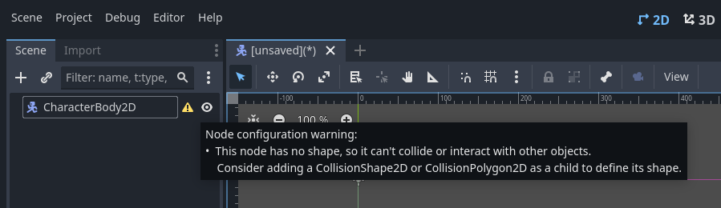

.. warning::
   *  *"Ce nœud n'a pas de forme, il ne peut donc pas entrer en collision ou interagir avec d'autres objets.
      Envisagez d'ajouter un* ``CollisionShape2D`` *ou un* ``CollisionPolygon2D`` *en tant qu'enfant pour définir sa forme."*

Qu'il en soit ainsi, ajoutons un ``CollisionShape2D`` en cliquant sur l'icône **+** en haut à gauche, en appuyant sur ``Ctrl+A`` ou encore en faisant: **Clic-droit -> Ajouter un nœud** sur le ``CharacterBody2D``.

Le nœud ``CollisionShape2D`` est utilisé pour ajouter des hitbox (boîtes de collision). C'est la chose qui permettra à notre joueur d'interagir physiquement avec le monde autour de lui.
Après avoir ajouté la CollisionShape2D, vous devriez avoir un autre warning disant que celle-ci n'a pas de forme.

Pour ajouter une shape, cliquez sur le nœud CollisionShape2D. Vous verrez alors que l'inspecteur, à droite de l'écran, affiche des informations sur la CollisionShape2D.
Ajoutez une ``CapsuleShape2D`` dans l'attribut ``shape``, qui est normalement vide. Vous devriez voir un espèce de Tic Tac™ bleu au milieu de votre écran, c'est la shape que vous venez d'ajouter:

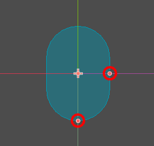

Vous pouvez changer sa taille avec les petits cercles oranges, mais on fera ça un tout petit peu plus tard.

.. _init-anims:

Création d'animations
---------------------

À présent, nous avons un joueur constitué d'un ``CharacterBody2D`` et d'une ``CollisionShape2D``. Il nous manque du visuel!
Nous allons donc ajouter un sprite à notre joueur.

.. note::
   Un *sprite*, c'est tout simplement une texture 2D, utilisée pour représenter un personnage, un décor, bref à peu près tout ce que vous voyez à l'écran dans un jeu 2D.

On veut que notre joueur ait des animations, donc ajoutez un nœud ``AnimatedSprite2D`` au joueur.

Faites attention à ce que le nœud soit un enfant du ``CharacterBody2D``, et non de la ``CollisionShape2D``. En effet, on ne veut pas ajouter un sprite à notre collision, on veut ajouter un sprite à notre joueur.
Si le nœud est mal placé dans l'arborescence, vous pouvez le drag-n-drop (restez appuyé sur le nœud et glissez-le) sur le nœud joueur.

Vous pouvez aussi renommer le nœud du joueur en ``"Player"``. Après ça, vous devriez avoir une arborescence comme ça:

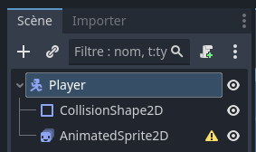

Encore un warning! Cette fois-ci sur l'``AnimatedSprite2D``. Ajoutez donc un ``SpriteFrames``, comme le recommande le warning.

.. tip::
   Pour ajouter un nouveau ``SpriteFrames``, cliquez d'abord sur l'AnimatedSprite2D dans l'arborescence.
   Vous aurez alors accès aux propriétés du nœud dans l'inspecteur, qui se trouve à droite de votre fenêtre.

Après avoir ajouté un nouveau SpriteFrames, une nouvelle fenêtre devrait apparaître en bas de votre écran.
Si ce n'est pas le cas, cliquez sur le ``SpriteFrames`` que vous venez de créer dans l'inspecteur.

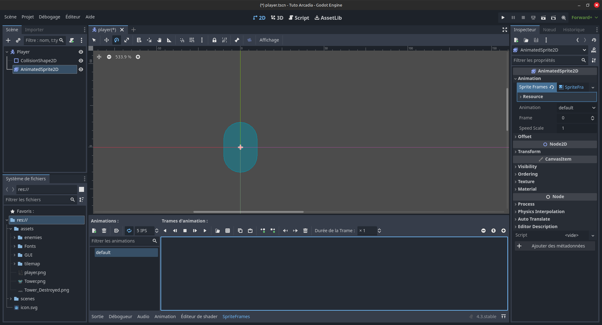

Cette fenêtre est l'éditeur d'animations. Vous pouvez la fermer et la réouvrir en cliquant sur *SpriteFrames* en bas de l'écran.
À gauche, vous trouverez une liste de toutes les animations disponibles. Pour l'instant, il n'y en a qu'une, elle s'appelle ``"default"``.
Renommez-la ``"idle"``.

.. note::
   Une animation d'idle, c'est l'animation qui se joue quand le personnage ne bouge pas.
   Généralement, elle représente le personnage qui respire, qui regarde un peu atour de lui, pour ajouter du mouvement à l'image et pour faire vivre le jeu.
   Dans certains jeux, si vous attendez suffisamment longtemps, des animations spéciales vont se jouer: le personnage qui se gratte la tête, qui s'assied par terre ou s'endort...

Cliquez ensuite sur l'icône de grille: *Add frames from sprite sheet*, et ouvrez le fichier ``assets/player.png``.

.. note::
   Une spritesheet est un fichier image qui contient toutes les frame d'animation d'un objet.
   Cela permet de n'avoir qu'un fichier, au lieu de plusieurs, ce qui économise de la place et facilite l'édition des animations.

Cela vous ouvrira le *Spritesheet Cutter*, qui ressemblera à ça:

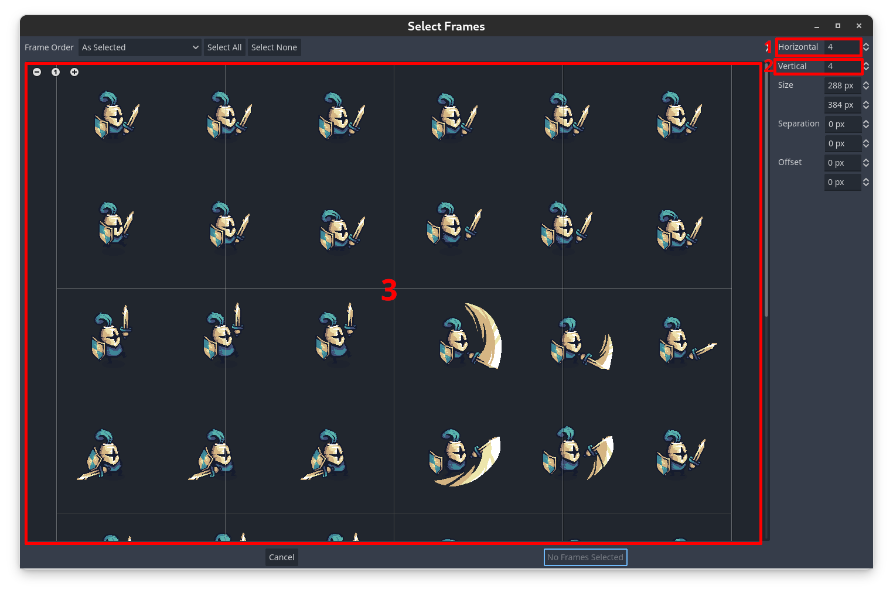

La spritesheet forme une grille où chaque frame de l'animation se trouve dans une case.
Vous pouvez alors mettre le nombre de frames par colonne **[1]** et le nombre de frames par ligne **[2]**. Pour nous, on a 6 colonnes et 8 lignes.

Une fois les frames alignées avec la grille **[3]**, vous pouvez séléctionner les 6 premières frames (toute la première ligne), en cliquant dessus dans l'ordre ou en restant appuyé.
Finalement, vous pouvez appuyer sur *Add 6 Frames* en bas, pour ajouter les frames à votre animation d'idle.
Vous devriez voir les frames sélectionnées apparaître dans l'éditeur en bas:

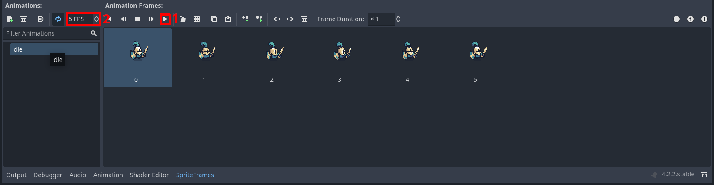

Maintenant, vous pouvez jouer l'animation, en appuyant sur **play** **[1]**,
et changer la vitesse de l'animation, en changeant ses **FPS** (Frames Per Second / Images par seconde) **[2]**.

Une animation d'idle c'est bien, mais, nous aimerions que notre joueur puisse bouger,
donc on va rajouter une animation de course, qu'on appellera ``run``.

Pour cela, appuyez sur **Add Animation**, en haut à gauche de la fenêtre `SpriteFrames`.
Renommez cette animation ``"run"``, et répétez les mêmes étapes que pour l'animation d'idle,
en sélectionnant les 6 frames suivantes (toute la deuxième ligne).

Pour plus de fluidité, vous pouvez mettre les deux animations à **8 FPS** (ou ajuster la vitesse à votre préférence).

Et finalement, vous pouvez ajuster la hitbox crée :ref:`précédemment <init-joueur>` à notre sprite.

.. _move-init:

Création des mouvements
-----------------------

Actuellement nous avons un joueur, qui a des animations, mais qui ne fait pas grand chose.
Si vous lancez la scène avec *F6* ou en cliquant sur *l'icône de Clap avec un petit triangle* en haut à droite, vous verrez votre joueur dans un coin de l'écran qui ne peut pas se déplacer.
Dans cette partie, nous allons lui ajouter des mouvements rudimentaires.

Création du script
~~~~~~~~~~~~~~~~~~

Pour ce faire, nous allons devoir utiliser des bouts de code.
Premièrement, nous allons rattacher un script au Joueur, en séléctionnant le CharacterBody2D dans la hiérarchie,
et en cliquant sur *l'icône en forme de parchemin* en haut de la fenêtre hiérarchie:
`Attach a new or existing script to the selected node`
Ce pop-up s'ouvrira alors:

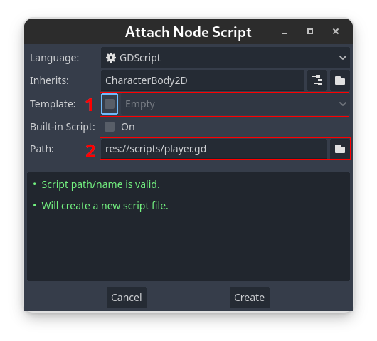

Il vous faudra:

1. Décocher la case template
2. Renseigner l'endroit où votre script sera stocké. Mettez-le dans un nouveau fichier, nommé ``scripts`` comme dans l'exemple.

Validez, et votre éditeur changera en mode "Script" pour ouvrir le fichier créé:

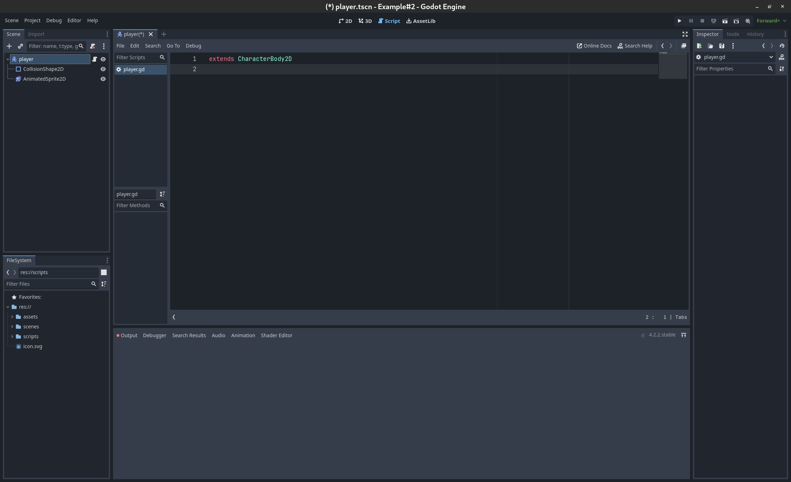

Initiation à GDScript
~~~~~~~~~~~~~~~~~~~~~

Le fichier créé est en GDScript, le langage de script utilisé par godot.
Ce langage est très similaire à python, donc si vous avez un peu d'expérience en python,
vous devrez être plutôt à l'aise en GDScript.

Nous allons voir ici les éléments essentiels de ce langage: les **variables** et les **fonctions**

**Les variables :**

Pour créer une variable, il faut écrire:

.. code-block:: gdscript

   var nom = valeur

Une variable n'a pas de type fixé, ce qui veut dire qu'elle peut changer de type (comme en python).
Mais on peut lui assigner un type pour:

- Éviter les erreurs de type
- Donner une indication du type de notre variable à notre éditeur, pour qu'il nous suggère des informations pertinentes

Pour ce faire, il faut écrire:

.. code-block:: gdscript

   var nom:type = valeur

Finalement, vous pouvez *"exporter"* vos variables,
pour faire en sorte qu'elles soient modifiables depuis l'éditeur principal, en mettant un ``@export`` devant:

.. code-block:: gdscript

   @export var nom:type = valeur

.. warning::
   Attention, vous ne pouvez pas *exporter* des variables définies dans des fonctions

**Les fonctions**

Pour créer une fonction, il faut écrire:

.. code-block:: gdscript

   func nom(var1, var2, ...):
      ...
      return var3

Cette syntaxe est très similaire à celle de python.
Si vous voulez spécifier les types de vos fonctions, vous pouvez faire:

.. code-block:: gdscript

   func nom(var1:type1, var2:type2, ...)->typeRetour:
      ...
      return var3

Vous allez parfois utiliser des fonctions prédéfinies, comme ``_ready()`` ou ``_physics_process(delta)``,
ce sont des fonctions qui sont utilisées par godot, et qui sont appelées à des moments précis.
Ce sont ces fonctions qui vont vous permettre de faire exécuter un bout de code, à un moment précis.
Par exemple:

- La fonction ``_ready`` est appelée dès que votre objet est ajouté dans votre jeu
- La fonction ``_physics_process(delta)`` est appelée à chaque fois que godot refait les calculs de physique (donc elle est appelée quasiment à chaque frame).
  Et le delta en paramètre est le temps passé depuis le dernier appel.

Implémentation mouvements rudimentaires
~~~~~~~~~~~~~~~~~~~~~~~~~~~~~~~~~~~~~~~

Concrètement, pour bouger notre joueur, il nous faut plusieurs choses:

1. Détecter à chaque update de la physique, où le joueur veut bouger
2. Modifier la vélocité du joueur
3. Faire bouger le joueur, et gérer les collisions avec les autres éléments

Pour celà, nous pouvons utiliser le code suivant:

.. code-block:: GDScript

   func _physics_process(delta):
       var directionX:int = Input.get_axis("ui_left", "ui_right")
       velocity.x = directionX * 300
       move_and_slide()

Ce code est dans la fonction ``_physics_process`` et s'exécutera donc à chaque update du moteur physique.
À chaque appel, nous initions une variable direction, qui va prendre comme valeur, la valeur de retour de ``Input.get_axis("ui_left", "ui_right")``

``Input.get_axis(input1, input2)`` est une fonction qui va prendre deux inputs, et qui va "simuler" un joystick entre les deux, et dire où ce joystick est.
Si le joystick est à gauche, donc que input1 est appuyé, la fonction renverra -1,
si le joystick est à droite, elle renverra 1,
sinon, elle renverra 0.

Ensuite, après avoir récupéré la direction du joueur sur l'axe X,
nous allons pouvoir changer la vélocité du joueur sur l'axe X,
en multipliant la direction par `300`, `300` étant la vitesse que l'on donnera à notre joueur.

Finalement, nous travaillons avec un ``CharacterBody2D``, et donc nous avons accès à la fonction ``move_and_slide()``,
qui va automatiquement faire bouger le joueur, et gérer ses collisions.

Pour tester ce code, vous pouvez appuyer sur ``F6`` (ou sur ``fn+F6``) pour faire tourner la scène actuelle.

.. hint:: Exercice:
   Maintenant que vous savez faire bouger le joueur sur l'axe X, essayez (sans regarder la suite) de le faire bouger
   sur l'axe Y.
   Indice: les inputs pour le haut et le bas sont respectivement ``"ui_up"`` et ``"ui_down"``

Une fois que nous avons fait les mouvements sur une axe, il est simple de les transposer sur l'autre axe:

.. code-block:: gdscript

   func _physics_process(delta):
       var directionX:int = Input.get_axis("ui_left", "ui_right")
       var directionY:int = Input.get_axis("ui_up", "ui_down")
       velocity.x = directionX * 300
       velocity.y = directionY * 300
       move_and_slide()

Mais pour simplifier notre code, nous n'allons pas utiliser une autre variable pour l'axe Y.
À la place, nous allons créer une variable ``direction`` qui sera un ``Vector2``, qui aura comme abscisse la valeur de
``directionX`` et comme ordonnée, celle de ``directionY``.
Voici le nouveau code, pour un mouvement dans les deux axes:

.. code-block:: gdscript

   @export var speed:float = 300

   func _physics_process(delta):
       var direction:Vector2 = Vector2(Input.get_axis("ui_left", "ui_right"), Input.get_axis("ui_up", "ui_down"))
       velocity = direction * speed
       move_and_slide()

Ce code fonctionne exactement de la même manière que le code précédent, mais à l'exception du précédent,
celui-ci n'a pas besoin d'assigner individuellement les valeurs de ``velocity.x`` et ``velocity.y``,
on assigne directement ``velocity``.
De plus, dans ce code, on va mettre la vitesse maximale dans une variable, ``speed``.

.. _anims-fin:

Animation du personage
----------------------

Actuellement, notre personage bouge, mais il reste toujours statiquement dans la même frame de la même animation.
Il est temps de changer ça !

Lancement de l'animation au début du jeu
~~~~~~~~~~~~~~~~~~~~~~~~~~~~~~~~~~~~~~~~

Il nous faut premièrement que l'animation du personnage se joue, dès qu'il est ajouté au jeu.
Pour faire cela, on peut utiliser ce code:

.. code-block:: gdscript

   func _ready():
       $AnimatedSprite2D.play("idle")

La fonction ``_ready()`` s'exécute dès que l'objet est ajouté à la scène.
Ensuite, la ligne ``$AnimatedSprite2D.play("idle")`` prend le fils ``AnimatedSprite2D`` de notre joueur,
et lui dit de jouer l'animation "idle" (l'animation par défaut)

Changement dynamique de l'animation
~~~~~~~~~~~~~~~~~~~~~~~~~~~~~~~~~~~

Maintenant que l'animation se joue, on aimerait bien qu'elle change dynamiquement selon si le personnage bouge, ou pas
Pour cela, on va détecter, dans ``_physics_process`` quand le joueur bouge, ou pas.

Vous pouvez alors ajouter ce bout de code à la fin de ``_physics_process``:

.. code-block:: gdscript

   func _physics_process(delta):
       ...
   	   if direction == Vector2.ZERO:
		   $AnimatedSprite2D.animation = "idle"
	   else:
		   $AnimatedSprite2D.animation = "run"

Donc à chaque update, on va regarder si le joueur est immobile (si il ne va dans aucune direction),
si `oui`, on va dire à l'``AnimatedSprite2D`` de changer l'animation à l'animation d'``idle``.
Si `non`, cela veut dire que le joueur est en train de bouger,
donc on va dire à l'``AnimatedSprite2D`` de changer l'animation à l'animation de ``run``.

Changement dynamique de l'orientation du sprite
~~~~~~~~~~~~~~~~~~~~~~~~~~~~~~~~~~~~~~~~~~~~~~~

Nous avons un sprite animé, qui change d'animation dynamiquement.
Mais qu'on aille à droite ou à gauche, le sprite, lui, est toujours tourné vers la droite.

Nous allons donc tourner le sprite du joueur, selon la direction dans laquelle le joueur va.

.. hint:: Exercice:
   Tourner le joueur selon là où il va est similaire à changer son animation selon si il court.
   Essayez donc d'implémenter cette fonctionalité tout seul, sans regarder la solution.
   Indice: Par défaut, ``$AnimatedSprite2D.flip_h = false``, et il faut mettre cette variable
   à ``true`` pour inverser le sprite.

Le code pour faire cela est:

.. code-block:: gdscript

	   if direction.x > 0:
		   $AnimatedSprite2D.flip_h = false
	   elif direction.x < 0:
		   $AnimatedSprite2D.flip_h = true

.. warning::
   Si dans le code précédent, vous aviez mis un ``else:`` à la place du ``elif direction.x < 0:``,
   votre joueur va se retourner à sa direction initiale, dès que vous arrêtez d'avancer.

.. _move-fin:

Peaufinage des mouvements
-------------------------

Actuellement, nous avons un système de mouvement qui fonctionne,
mais qui est assez rudimentaire, nous allons donc l'améliorer!

Ajustement des mouvements en diagonales
~~~~~~~~~~~~~~~~~~~~~~~~~~~~~~~~~~~~~~~

Le premier problème, c'est que notre joueur se déplace plus vite quand il va en diagonale, que lorsqu'il va en ligne doite:

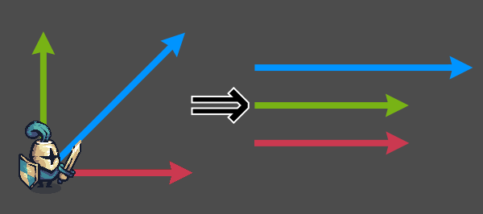

On voit ici que le vecteur bleu (en diagonale) a une norme plus grande que les vecteurs rouge et vert (qui sont unitaire, c'est-à-dire que leur norme vaut 1).
Ainsi, lorsque le personnage se déplace en diagonale, il va plus vite:

.. math::
   N_{rouge} = \left\| \begin{pmatrix} 1 & 0 \end{pmatrix} \right\| = 1 \quad
   N_{vert} = \left\| \begin{pmatrix} 0 & 1 \end{pmatrix} \right\| = 1 \quad
   N_{bleu} = \left\| \begin{pmatrix} 1 & 1 \end{pmatrix} \right\| = \sqrt{2}

Pour régler cela, il faut faire en sorte que la longueur du vecteur direction soit toujours égale à 1, on appelle ça normaliser un vecteur.
Pour cela, il existe la méthode ``.normalized()`` qui renvoie le vecteur normalisé.

Vous pouvez donc la rajouter à la fin de la définition de ``direction``:

.. code-block:: gdscript

   var direction:Vector2 = Vector2(Input.get_axis("ui_left", "ui_right"), Input.get_axis("ui_up", "ui_down")).normalized()

Ajout d'inertie
~~~~~~~~~~~~~~~

Actuellement, notre joueur atteint sa vitesse maximale instantanément, et s'arrête instantanément.
Pour remédier à ce problème, nous allons utiliser une fonction, appelée ``lerp``, qui s'utilise de cette façon:

.. code-block:: gdscript

   val = lerp(val, max_val, poids)

Elle va retourner la prochaine valeur que notre variable doit prendre,
pour avoir une transition douce entre la valeur initiale et notre valeur maximale.
Le poids va nous permettre de déterminer la "douceur" de la transition:

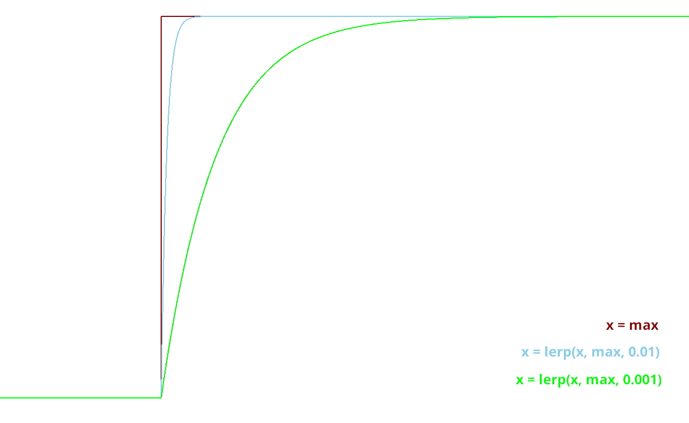

Dans notre cas, le poids représentera l'accélération.
Or, on veut qu'elle dépende du temps qui s'est écoulé,
et pas du nombre de frames (car le nombre de frame par seconde peut varier selon les ordinateurs).

On peut donc initier une variable ``acceleration`` dans le corps principal:

.. code-block:: gdscript

   @export var acceleration:float = 10

Et changer la ligne qui assignait une valeur à ``velocity`` dans ``_physics_process(delta):``:

.. code-block:: gdscript

   velocity = lerp(velocity, direction * speed, acceleration * delta)

Et avec ça, nous avons fini la création de notre joueur, ainsi que de son système de mouvement !