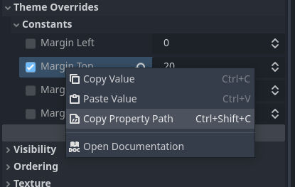
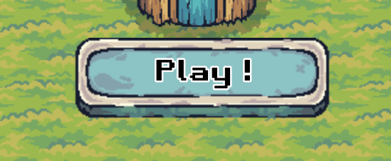
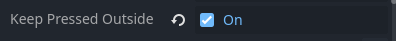
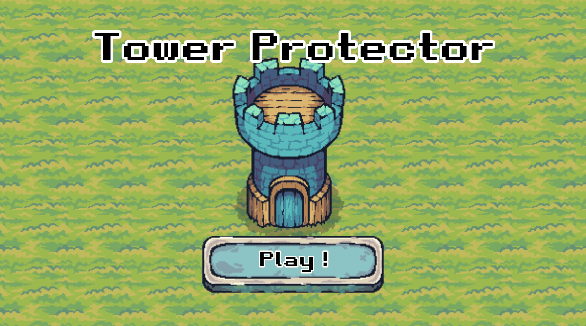

Création du menu
================

Dernière étape! Dans cette partie, on va créer le menu du jeu, et le connecter au monde pour qu'il réapparaisse lorsque la partie est terminée.

.. image:: img/menu.png

La scène
--------

Analyse du menu
~~~~~~~~~~~~~~~

Comme pour la barre de vie, il y a plein de manières différentes pour arriver au même résultat.
Analysons un peu le menu que l'on doit reproduire. On sait qu'on aura au moins:

- Un nœud ``Control`` pour contenir le tout.
- Un nœud ``TextureRect`` pour l'image de fond.
- Un nœud ``Label`` pour écrire le titre **Tower Protector**.
- Un nœud ``TextureButton`` pour faire un bouton cliquable avec une image.
- Un nœud ``Label``, encore, cette fois-ci pour écrire **Play !** sur le bouton.

On va bien entendu rajouter d'autres nœuds ``MarginContainer`` et ``Control`` pour les mêmes raisons que l'on a évoquées lors de la partie précédente.

On va aussi faire l'introduction d'un nouveau nœud, la ``VBoxContainer``.

.. note::
    Le nœud ``VBoxContainer`` est utilisé pour ranger ces enfants verticalement, les uns au dessus des autres, sans qu'ils ne se touchent.
    Cela permet de créer un affichage en forme de liste assez rapidement et ça rend le tout plutôt clean.
    Ici, on s'en servira pour ranger verticalement le ``Label`` **Tower Protector** au dessus du bouton **Play !**.
    Il existe aussi le ``HBoxContainer`` qui fait la même chose horizontalement.

Finalement, on aura une organisation comme ça:

.. image:: img/menucontrol.png

Création
~~~~~~~~

Commençons sans plus tarder. Créez une nouvelle scène avec un ``Node`` (le rond blanc), appelez-le ``Main`` et sauvegardez la scène ``main.tscn``.
Ajoutez un nœud ``Control`` en enfant, que vous pouvez renommer ``Menu``.

.. note::
    On reviendra plus tard, dans la partie Script, pourquoi on ajoute le nœud ``Main``.
    Pour l'instant, faites comme s'il n'était pas là, et faites toute la suite à partir du nœud ``Menu.``

Ensuite, on veut une image de fond. Ajoutez donc un nœud ``TextureRect`` en enfant, et ajoutez-y le fichier ``assets/GUI/BackGround.png`` dans l'Inspecteur.
Vous verrez alors l'image de fond apparaître. Vous pouvez mettre les deux nœuds en mode **Full Rect**, ça centrera l'image.

Ensuite, on souhaite mettre les éléments restants au milieu. On va déjà créer un ``MarginContainer`` pour centrer tout ça.
Ajoutez-le en enfant de ``Menu``, mettez-le en **Full Rect**, puis mettez les margin suivantes:

.. image:: img/marginmenu1.png

Dedans, ajoutez un ``VBoxContainer``, il va nous permettre de mettre à la verticale le titre et le bouton.
Vous pouvez ajouter par exemple plusieurs nœuds ``Label`` en enfant du ``VBoxContainer`` pour mieux comprendre son fonctionnement.

Au final, ne gardez qu'un seul nœud ``Label``. Écrivez-y le texte "Tower Protector", et copiez les **Label Settings** de la partie précédente.
Cliquez-droit sur les settings, et appuyez sur **Make Unique**.

.. image:: img/makeunique.png

.. note::
    En faisant **Make Unique** sur une ressource, cela rend cette ressource unique. En effet, une même ressource peut être partagée entre plusieurs objets qui l'utilisent.
    Ainsi, si on avait pas rendu la ressource unique, et qu'on avait changé, par exemple, la taille du texte, la taille du texte aurait aussi changé dans le ``Label`` de la GUI,
    car ils utilisent la même ressource.
    
    Une ressource peut aussi utiliser d'autres ressources. Ainsi, si vous cliquez sur **Make Unique (Recursive)**, cela rend aussi ces ressources uniques.
    Si vous n'êtes pas sûr de vous, et que vous voulez être sûr de ne rien casser autre part, cliquez sur l'option **Recursive**.

Changez les settings en mettant la taille du texte à ``75px`` et celle de l'outline à ``20px``.
Pour centrer le texte, changez le **Horizontal Alignment** du ``Label`` en **Center**.

Ok, ajoutez ensuite un nœud ``Control``, toujours en enfant du ``VBoxContainer``, en dessous du ``Label`` pour le titre.
Vous pouvez voir que le nouveau ``Control`` apparaît en dessous du ``Label``. Ce nœud va contenir tous les autres nœuds qui serviront à faire le bouton.

Premièrement, ajoutez un nœud ``TextureButton`` en enfant de ``Control``.

.. note::
    Les nœuds ``TextureButton`` sont des boutons qui prennent une ou plusieurs images, et qui permettent de faire des boutons plus beaux et plus simple à customiser visuellement que les simples ``Button``.

Dans l'Inspecteur, sous l'onglet **Textures**, ajoutez les images ``assets/GUI/Button_Blue.png`` et ``assets/GUI/Button_Blue_Pressed.png`` au propriétés correspondantes.
On ne se servira pas des autres propriétés mais il est tout à fait possible de s'en servir.

.. image:: img/texturebutton.png

Vous devriez avoir quelque chose comme ça si tout se passe bien:

.. image:: img/menupourri.png

Bon, le bouton est pas vraiment à sa place, et en plus il est beaucoup trop petit...
Réglons d'abord la position du bouton. Pour ça, il faut déjà mettre le nœud ``Control`` en mode **Expand** en cliquant en haut dans l'editeur:

.. image:: img/expandcontrol.png

Ensuite, mettez le ``TextureButton`` en mode **Center Bottom** (au même endroit que pour le **Full Rect**).
Si vous pensez que le bouton n'est pas centré, c'est normal. En fait c'est l'image de fond qui n'est pas ouf, c'est la tour qui n'est pas centrée, on s'occupera de ça juste après.
Mais le bouton est bien centré, ne vous inquiétez pas.

Pour changer la taille du bouton, il y a plusieurs manières possibles. La manière la plus simple est de changer la **Scale** dans **Layout -> Transform**.
Cependant, si on fait comme ça, il sera plus difficile de placer correctement le bouton. On peut donc utiliser la deuxième solution.

Multipliez la **Size** du bouton par 2. Vous pouvez écrire directement la nouvelle valeur,
ou vous pouvez écrire \*2 après l'ancienne valeur, Godot comprend qu'il s'agit d'une multiplication et va donc multiplier la valeur par 2.

.. image:: img/buttonsize.png

Votre bouton va rester petit, mais la boîte orange, qui indique la zone de votre ``TextureButton``, va grandir. Mettez le **Stretch Mode** du ``TextureButton`` sur **Scale**.
Vous pouvez voir votre bouton qui est maintenant 2 fois plus gros! Remettez-le en **Center Bottom** pour le remettre bien au centre.

Pour recentrer la tour, sélectionnez le ``TextureRect``, et bougez-le, soit en changeant sa position dans l'Inspecteur, soit en utilisant les flèches du clavier lorsqu'il est sélectionné.
Vous devriez avoir quelque chose comme ça à ce stade:

.. image:: img/menumoinspourri.png

Ok, il ne manque plus que le texte **Play !**. Pour ça, ajoutez un ``MarginContainer`` en enfant du ``TextureButton``, puis un ``Label`` en enfant du ``MarginContainer``.
Mettez le **MarginContainer** en mode **Full Rect**, et changez sa **Margin Top** à ``20px``.
Enfin, copiez le **Label Settings** précédent, rendez-le unique, et changez la taille du texte à ``40px`` et la taille de l'outline à ``10px``.
Écrivez "Play !" et centrez le texte en changeant l'**Horizontal Alignment**, et voilà!

En lançant la scène, vous pourrez observer que le texte **Play !** ne suit pas le bouton lorsqu'on appuie dessus. À part ça, tout est bon!

.. image:: img/playbutton.gif

On règlera ça plus tard dans le script, en changeant la valeur du **Margin Top** que l'on vient de mettre. On va essayer de récupérer cette valeur tout de suite pour pas avoir à le faire plus tard.
En pratique, vous devriez calculer de combien de pixels le sprite du ``TextureButton`` est décalé lorsqu'il est pressé.
Pour ça, vous pouvez faire de plusieurs manières différentes, en essayant de calculer à la main, ou en prenant les sprites sur un logiciel de photomontage...
Bref, on obtient que le bouton descend de ``4px``, donc il faudra changer la **Margin Top** à ``28px`` (n'oublions pas le \*2!) dans le script.

Le script
---------

L'objectif principal du script du menu est de faire la transition entre le menu en lui-même et le monde.

Le Scene Manager
~~~~~~~~~~~~~~~~

En fait, on va créer un **Scene Manager**. Ce terme peut désigner plusieurs choses mais ici, ça va être une scène qui va contenir les autres scènes principales de notre jeu (donc ici, le menu et le monde).
Le Scene Manager a les autres scènes comme enfant. Au début, elle a la scène ``Menu`` en enfant, puis une fois que l'on clique sur Play, elle cache ``Menu`` et ajoute la scène ``World`` en enfant.
Lorsque le joueur perd, on appelle ``queue_free()`` sur l'enfant ``World``, et on rend le menu visible de nouveau.

Ce système de **Scene Manager** peut être très utile dans certains cas et simplifier le jeu, l'optimiser etc, par exemple en pré-chargeant les prochains niveaux, plutôt que de les charger directement au moment où on en a besoin.

.. note::
    Notez qu'ici, le système que nous mettrons en place n'est pas très optimisé, puisqu'on crée, et on détruit la scène ``World`` à chaque fois que l'on recommence le jeu.
    Il serait meilleur par exemple, de créer une fonctionnalité de "reset" de la scène, qui remet toutes les variables à zéro, sans détruire la scène (on vous laisse ça en exercice une fois le tuto terminé).
    Ici, ce n'est pas très grave, puisque la scène est très légère, mais pour des jeux plus complexes, il est nécessaire d'envisager ce genre de solutions.

En fait, on a déjà les débuts de notre **Scene Manager**. Si vous ne l'aviez pas deviné, il s'agit du nœud ``Main`` que nous avons créé au tout début de cette partie.

Ajoutez-donc un script au nœud ``Main``: ``main.gd``.
Détaillons ce que ce script doit faire:

-   Lorsque l'on appuie sur le bouton Play, cacher le menu, et ajouter la scène ``World`` en enfant.
-   Lorsque le joueur perd (lorsque le signal is_dead est émit par la tour), détruire l'enfant ``World`` et rendre le menu visible.
-   Bonus: lorsque le bouton est appuyé, descendre le label **Play !**.

Lancer le jeu
~~~~~~~~~~~~~

Il nous faut détecter lorsque le bouton est appuyé, pour ça, connectez le signal ``pressed`` du ``TextureButton``.
Il nous faut ensuite ajouter la scène ``World`` en enfant. On a vu comment faire ça avec les ennemis, donc on peut faire pareil:

.. code:: gdscript

    extends Node

    @export var world: PackedScene

    func _on_texture_button_pressed() -> void:
        # Faire apparaître le monde
        var world_instance = world.instantiate()
        add_child(world_instance)
        # Cacher le menu
        $Menu.hide() # équivalent à: $Menu.visible = false
    
Dans l'Inspecteur, glissez la scène ``world.tscn`` dans la variable world.

.. warning::
    Il est important de cacher le menu, car même s'il ne sera pas visible (car la scène du monde sera par dessus),
    il sera toujours possible d'appuyer sur le bouton **Play**, et donc d'ajouter toujours plus de scènes ``World``.

Ok! En lançant la scène ``Main``, vous pourrez cliquer sur le bouton **Play** et jouer au jeu!

Revenir au menu
~~~~~~~~~~~~~~~

Maintenant, lorsque la tour se fait détruire, il faut revenir au menu. Pour ça, on dispose du signal ``is_dead`` de la tour que l'on a créé exprès.
Or, on ne peut pas connecter directement le signal de la tour via l'Inspecteur. On va donc voir une autre manière de connecter les signaux dans Godot, via un script
(c'est d'ailleurs la "bonne" manière de faire).

Pour ça, juste après l'ajout du monde à la ligne ``add_child(world_instance)``, rajoutez:

.. code:: gdscript

    world_instance.get_node("Tower").is_dead.connect(game_over)

Cette ligne nous permet de récupérer le nœud qui s'appelle "Tower" en enfant du nœud world_instance, et de connecter le signal ``is_dead`` à la fonction ``game_over``.
On va créer cette fonction juste après dans le script ``Main``. Grâce à ça, dès que ``is_dead`` est émit, la fonction ``game_over`` est appelée.

La fonction ``game_over`` n'est pas encore créée, donc l'éditeur nous crie un peu dessus. Créons-la:

.. code:: gdscript

    func game_over():
        get_node("World").queue_free() # Détruire le monde
        $Menu.show() # Rendre le menu de nouveau visible

Testez le jeu en lançant la scène ``Main``. Tout est bon, mais la transition lorsqu'on perd est un peu abrupte.
On va rajouter un timer de quelques secondes pour avoir le temps d'admirer notre défaite avant de retourner au menu.

On pourrait rajouter un nœud **Timer** dans la scène ``World`` ou ``Main``, mais cela nous rajouterait du travail, car il faudrait connecter les signaux correctement et tout.
On va donc vous montrer comment créer un Timer via un script. Ajoutez la ligne suivante au tout début de la fonction ``game_over()``:

.. code:: gdscript

    await get_tree().create_timer(3.0).timeout

En gros, la méthode ``get_tree().create_timer(3.0)`` renvoie un Timer qui démarre automatiquement et qui dure 3 secondes (on peut mettre n'importe quelle durée à la place).
Le mot clé ``await`` précise que l'on doit attendre qu'un signal spécifique soit émit ou qu'une fonction se termine avant de continuer le code.
Ici, on attend que le Timer créé émette le signal ``timeout`` (c'est-à-dire qu'il s'arrête).
Le reste du code de la fonction ``game_over()`` sera exécuté après l'émission du signal, c'est-à-dire, après 3 secondes.

Positionnement du Label
~~~~~~~~~~~~~~~~~~~~~~~

Allez c'est bientôt la fin, on s'était promis qu'on allait le faire, il nous reste plus que ça.
Il nous faut descendre le ``Label`` lorsque le ``TextureButton`` est appuyé, et le remonter lorsqu'il ne l'est plus.

Pour détecter ces deux événements, connectez les signaux ``button_up`` et ``button_down`` au script de ``Main``, puis écrivez:

.. code:: gdscript

    # Variable utilisée pour prendre moins de place à l'écrit, représente le MarginContainer
    @onready var margin := $Menu/MarginContainer/VBoxContainer/Control/TextureButton/MarginContainer

    func _on_texture_button_button_down() -> void:
        margin.set("theme_override_constants/margin_top", 28)

    func _on_texture_button_button_up() -> void:
        margin.set("theme_override_constants/margin_top", 20)

La méthode ``set`` prend en argument une propriété, et la valeur à mettre à cette propriété. 
Vous pouvez accéder au chemin complet d'une propriété en faisant **Clic droit -> Copy Property Path** sur la propriété dans L'inspecteur:

En lançant le jeu, on voit que c'est pas mal, mais si on bouge la souris en restant appuyé, le bouton remonte mais le Label reste en bas:

Pour régler ça vite fait, vous pouvez activer **Keep Pressed Outside** dans l'Inspecteur du ``TextureButton``:

Fin
---

Voilà... c'est la fin d'une grande aventure... Vous venez de créer votre premier jeu avec Godot!
On espère de tout cœur que ça vous aura plu. N'hésitez pas à venir poser des questions sur le serveur discord Arcadia si vous en avez!

**Crédits:**

-   Jules pour le tuto écrit (tout ce que vous venez de lire quoi)
-   Dimitri pour avoir créé le jeu de base et fait le tuto en atelier
-   Arcadia, A24

Vous êtes encore là? Bon, vous méritez bien un p'tit cadeau, cliquez sur la partie suivante!