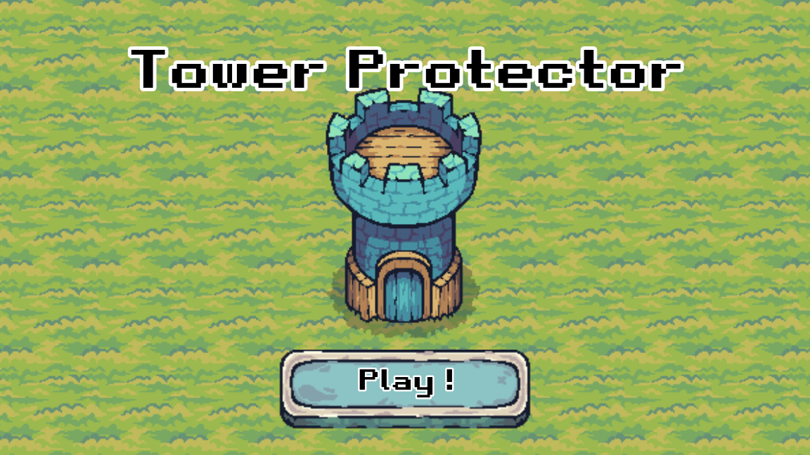
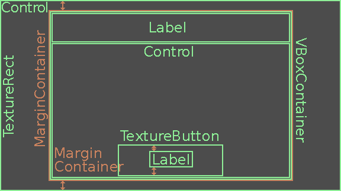
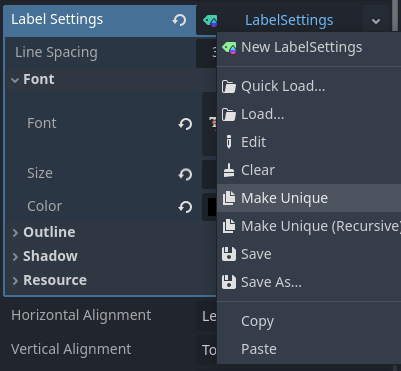
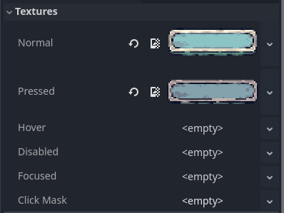
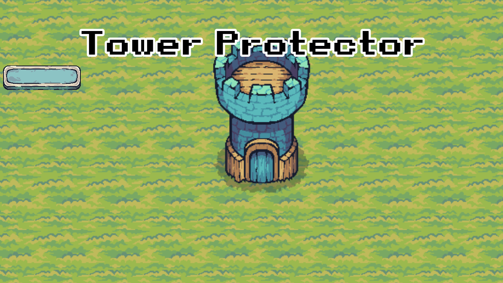
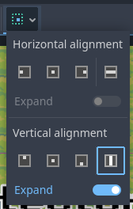
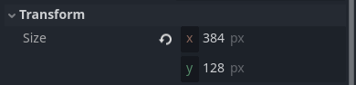
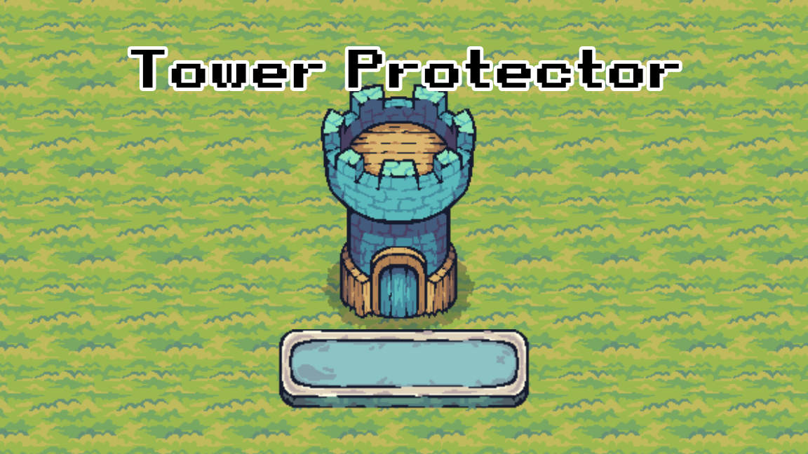
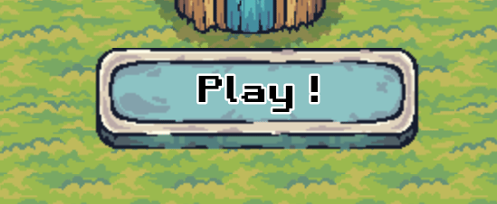

Création du menu
================

Dernière étape! Dans cette partie, on va créer le menu du jeu, et le connecter au monde pour qu'il réapparaisse lorsque la partie est terminée.

La scène
--------

Analyse du menu
~~~~~~~~~~~~~~~

Comme pour la barre de vie, il y a plein de manières différentes pour arriver au même résultat.
Analysons un peu le menu que l'on doit reproduire. On sait qu'on aura au moins:

- Un nœud ``Control`` pour contenir le tout.
- Un nœud ``TextureRect`` pour l'image de fond.
- Un nœud ``Label`` pour écrire le titre **Tower Protector**.
- Un nœud ``TextureButton`` pour faire un bouton cliquable avec une image.
- Un nœud ``Label``, encore, cette fois-ci pour écrire **Play !** sur le bouton.

On va bien entendu rajouter d'autres nœuds ``MarginContainer`` et ``Control`` pour les mêmes raisons que l'on a évoquées lors de la partie précédente.

On va aussi faire l'introduction d'un nouveau nœud, la ``VBoxContainer``.

.. note::
    Le nœud ``VBoxContainer`` est utilisé pour ranger ces enfants verticalement, les uns au dessus des autres, sans qu'ils ne se touchent.
    Cela permet de créer un affichage en forme de liste assez rapidement et ça rend le tout plutôt clean.
    Ici, on s'en servira pour ranger verticalement le ``Label`` **Tower Protector** au dessus du bouton **Play !**.
    Il existe aussi le ``HBoxContainer`` qui fait la même chose horizontalement.

Finalement, on aura une organisation comme ça:

Création
~~~~~~~~

Commençons sans plus tarder. Créez une nouvelle scène avec un nœud ``Control``, que vous pouvez renommer ``Menu``, et sauvegardez la scène ``menu.tscn``.

Ensuite, on veut une image de fond. Ajoutez donc un nœud ``TextureRect`` en enfant, et ajoutez-y le fichier ``assets/GUI/BackGround.png`` dans l'Inspecteur.
Vous verrez alors l'image de fond apparaître. Vous pouvez mettre les deux nœuds en mode **Full Rect**, ça centrera l'image.

Ensuite, on souhaite mettre les éléments restants au milieu. On va déjà créer un ``MarginContainer`` pour centrer tout ça.
Ajoutez-le en enfant de ``Menu``, mettez*le en **Full Rect**, puis mettez les margin suivantes:

.. image:: img/marginmenu1.png

Dedans, ajoutez un ``VBoxContainer``, il va nous permettre de mettre à la verticale le titre et le bouton.
Vous pouvez ajouter par exemple plusieurs nœuds ``Label`` en enfant du ``VBoxContainer`` pour mieux comprendre son fonctionnement.

Au final, ne gardez qu'un seul nœud ``Label``. Écrivez-y le texte "Tower Protector", et copiez les **Label Settings** de la partie précédente.
Cliquez-droit sur les settings, et appuyez sur **Make Unique**.

.. note::
    En faisant **Make Unique** sur une ressource, cela rend cette ressource unique. En effet, une même ressource peut être partagée entre plusieurs objets qui l'utilisent.
    Ainsi, si on avait pas rendu la ressource unique, et qu'on avait changé, par exemple, la taille du texte, la taille du texte aurait aussi changé dans le ``Label`` de la GUI,
    car ils utilisent la même ressource.
    
    Une ressource peut aussi utiliser d'autres ressources. Ainsi, si vous cliquez sur **Make Unique (Recursive)**, cela rend aussi ces ressources uniques.
    Si vous n'êtes pas sûr de vous, et que vous voulez être sûr de ne rien casser autre part, cliquez sur l'option **Recursive**.

Changez les settings en mettant la taille du texte à ``75px`` et celle de l'outline à ``20px``.
Pour centrer le texte, changez le **Horizontal Alignment** du ``Label`` en **Center**.

Ok, ajoutez ensuite un nœud ``Control``, toujours en enfant du ``VBoxContainer``, en dessous du ``Label`` pour le titre.
Vous pouvez voir que le nouveau ``Control`` apparaît en dessous du ``Label``. Ce nœud va contenir tous les autres nœuds qui serviront à faire le bouton.

Premièrement, ajoutez un nœud ``TextureButton`` en enfant de ``Control``.

.. note::
    Les nœuds ``TextureButton`` sont des boutons qui prennent une ou plusieurs images, et qui permettent de faire des boutons plus beaux et plus simple à customiser visuellement que les simples ``Button``.

Dans l'Inspecteur, sous l'onglet **Textures**, ajoutez les images ``assets/GUI/Button_Blue.png`` et ``assets/GUI/Button_Blue_Pressed.png`` au propriétés correspondantes.
On ne se servira pas des autres propriétés mais il est tout à fait possible de s'en servir.

Vous devriez avoir quelque chose comme ça si tout se passe bien:

Bon, le bouton est pas vraiment à sa place, et en plus il est beaucoup trop petit...
Réglons d'abord la position du bouton. Pour ça, il faut déjà mettre le nœud ``Control`` en mode **Expand** en cliquant en haut dans l'editeur:

Ensuite, mettez le ``TextureButton`` en mode **Center Bottom** (au même endroit que pour le **Full Rect**).
Si vous pensez que le bouton n'est pas centré, c'est normal. En fait c'est l'image de fond qui n'est pas ouf, c'est la tour qui n'est pas centrée, on s'occupera de ça juste après.
Mais le bouton est bien centré, ne vous inquiétez pas.

Pour changer la taille du bouton, il y a plusieurs manières possibles. La manière la plus simple est de changer la **Scale** dans **Layout -> Transform**.
Cependant, si on fait comme ça, il sera plus difficile de placer correctement le bouton. On peut donc utiliser la deuxième solution.

Multipliez la **Size** du bouton par 2. Vous pouvez écrire directement la nouvelle valeur,
ou vous pouvez écrire \*2 après l'ancienne valeur, Godot comprend qu'il s'agit d'une multiplication et va donc multiplier la valeur par 2.

Votre bouton va rester petit, mais la boîte orange, qui indique la zone de votre ``TextureButton``, va grandir. Mettez le **Stretch Mode** du ``TextureButton`` sur **Scale**.
Vous pouvez voir votre bouton qui est maintenant 2 fois plus gros! Remettez-le en **Center Bottom** pour le remettre bien au centre.

Pour recentrer la tour, sélectionnez le ``TextureRect``, et bougez-le, soit en changeant sa position dans l'Inspecteur, soit en utilisant les flèches du clavier lorsqu'il est sélectionné.
Vous devriez avoir quelque chose comme ça à ce stade:

Ok, il ne manque plus que le texte **Play !**. Pour ça, ajoutez un ``MarginContainer`` en enfant du ``TextureButton``, puis un ``Label`` en enfant du ``MarginContainer``.
Mettez le **MarginContainer** en mode **Full Rect**, et changez sa **Margin Top** à ``20px``.
Enfin, copiez le **Label Settings** précédent, rendez-le unique, et changez la taille du texte à ``40px`` et la taille de l'outline à ``10px``.
Écrivez "Play !" et centrez le texte en changeant l'**Horizontal Alignment**, et voilà!

En lançant la scène, vous pourrez observer que le texte **Play !** ne suit pas le bouton lorsqu'on appuie dessus. À part ça, tout est bon!

On règlera ça dans le script, en changeant la valeur du **Margin Top** que l'on vient de mettre. On va essayer de récupérer cette valeur tout de suite pour pas avoir à le faire plus tard.
En pratique, vous devriez calculer de combien de pixels le sprite du ``TextureButton`` est décalé lorsqu'il est pressé.
Pour ça, vous pouvez faire de plusieurs manières différentes, en essayant de calculer à la main, ou en prenant les sprites sur un logiciel de photomontage...
Bref, on obtient que le bouton descend de ``4px``, donc il faudra changer la **Margin Top** à ``28px`` (n'oublions pas le \*2!) dans le script.

Le script
---------