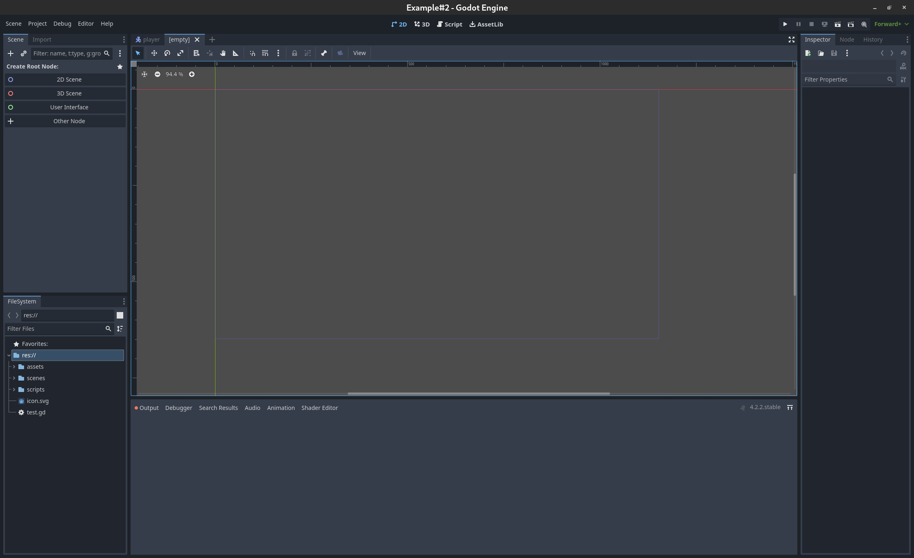
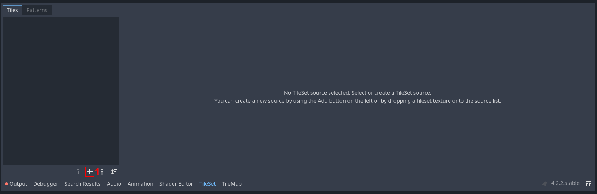
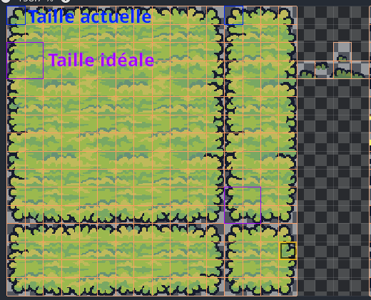
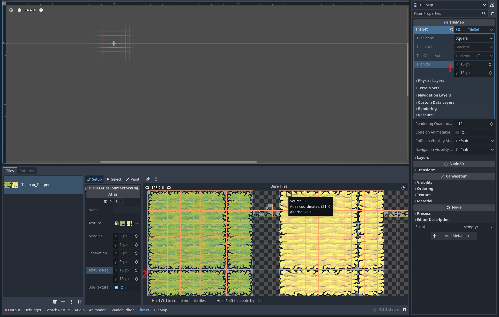

Création du monde
=================

Initialisation du monde
-----------------

Actuellement, on as un joueur, mais on n'as pas le monde dans lequel ce joueur doit se déplacer.
Pour ce faire, on va commencer par créer une nouvelle scène qui sera notre `Monde`.
Cliquez sur ``Scene -> New Scene`` en haut à droite, ou appuyez sur ``Ctrl+N``.
Une nouvelle scène vierge devrait s'ouvir:

.. hint:: Si vous êtes restés dans l'éditeur de code, vous pouvez revenir à l'éditeur 2D,
  en cliquant sur le bouton ``2D``, en haut de la fenêtre.

Ici, nous allons créer une ``Node2D``, pour ça, appuyez sur ``2D Scene`` dans la hiérarchie (en haut à gauche)
Vous pouvez renommer ce noeud en `World`, et lui ajouter une tilemap
(en appuyant sur ``Ctrl+A``, et en cherchant le noeud tilemap dans le popup)

.. note:: Une ``Tilemap`` est une technique populaire pour créer des environnement en 2D.
Il sagit de créer le monde en collant les uns aux autres des petites images, appelés `tiles`.
Ça permet non seulement de simplifier la création de niveau, mais ça permet également d'optimiser le jeu.

Customisation de la Tilemap
-----------------

Nous venons de créer une ``Tilemap``, mais elle ne contient pas encore de `tiles` à placer dans notre monde.
Pour ça, on va créer un ``Tileset``, qui va, entres euatres, contenir toutes nos tiles à placer dans notre monde.
Donc, dans l'Inspecteur de la ``tilemap``, cliquez sur ``Tileset -> New Tileset``.
Les onglets ``Tileset`` et ``Tilemap`` devraient alors s'être ouverts dans la fenêtre du bas de l'éditeur.
Cliquez sur l'onglet ``Tileset``:

Appuyez sur le bouton ``+`` **[1]**, cliquez sur ``Atlas``, puis séléctionnez le fichier ``assets/tilemap/Tilemap_Flat.png``.
Godot va alors vous demander si vous voulez créer automatiquement des tiles dans l'Atlas.
Séléctionnez oui, et vous verrez une grille découper l'image en blocks.
Néanmoins, vous pouvez voir que les carrés de cette grilles sont 2 fois trop petits que ce qu'ils devraient être:

Pour régler ce problème, il faut changer la taille des `tiles`, les changeant de ``16px`` à ``32px``,
à la fois dans l'éditeur de la ``Tilemap`` [1] et dans celui du ``Tileset`` [1]

Maintenant que vous avez crée votre tileset, vous pouvez aller dans l'onglet ``Tilemap``, pour "peindre" le monde.

Maintenant,

[temp]

- Ajout des murs
- Ajout du joueur dans ce monde