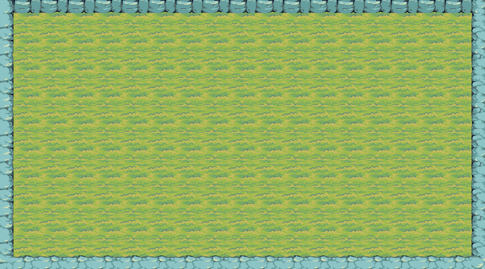
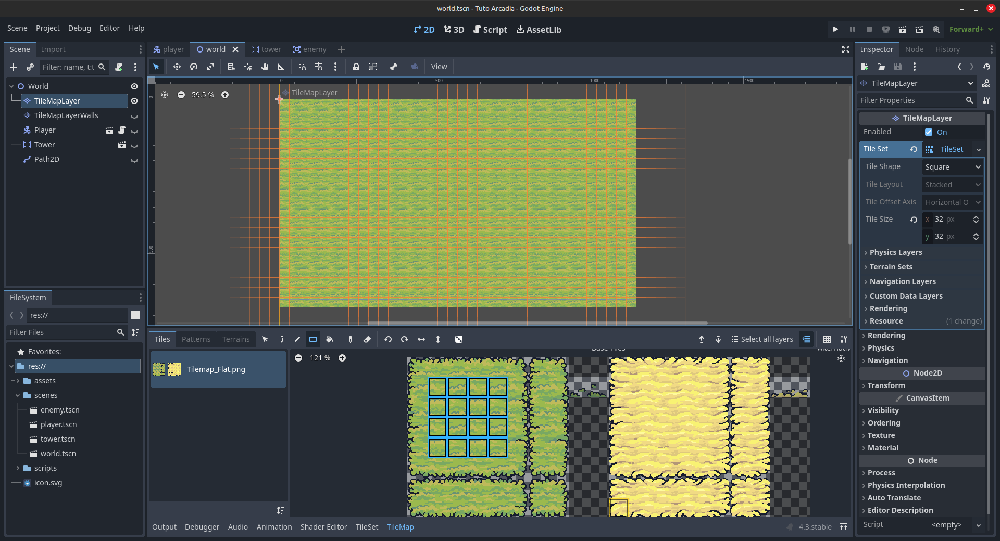
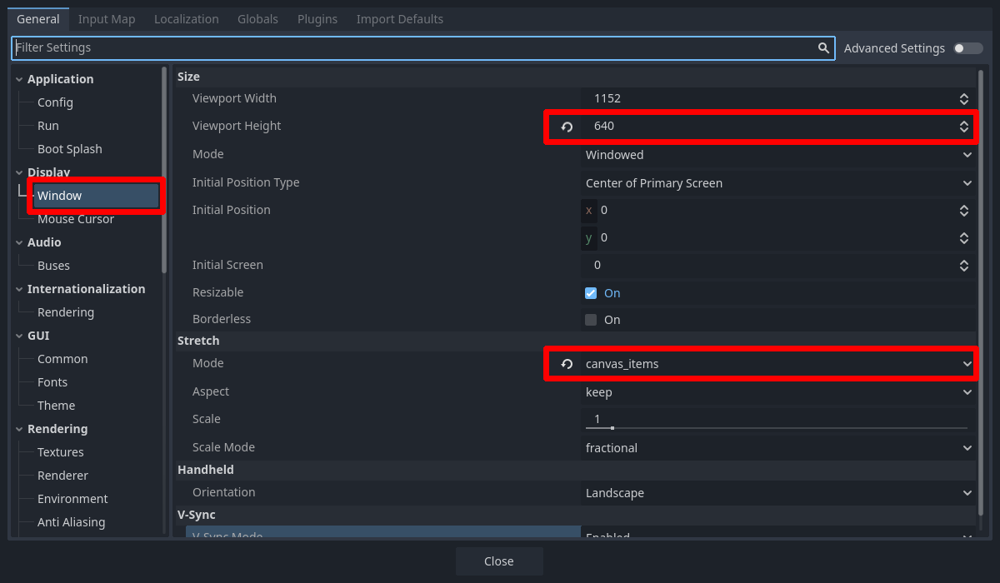
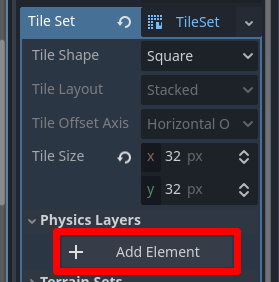
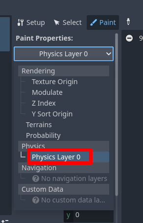
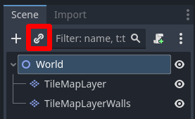

Création du monde
=================

Initialisation du monde
-----------------------

Actuellement, on a un joueur, mais on n'a pas le monde dans lequel ce joueur doit se déplacer.
Pour ce faire, on va commencer par créer une nouvelle scène qui sera notre `Monde`.

Dans cette partie, on va faire tout ce que vous voyez sur l'image ci-dessous.
À savoir, l'herbe, et les murs, qui auront une collision pour que le joueur ne puisse pas les traverser.

Cliquez sur **Scene -> New Scene** en haut à droite, ou sur le petit **+** en haut à côté de l'onglet de la scène ``player``, ou appuyez sur ``Ctrl+N``.
Une nouvelle scène vierge devrait s'ouvir:

.. image:: img/worldCreation.png

.. hint:: Si vous êtes restés dans l'éditeur de code, vous pouvez revenir à l'éditeur 2D,
  en cliquant sur le bouton ``2D``, en haut de la fenêtre.

Ici, nous allons créer un ``Node2D``, pour ça, appuyez sur ``2D Scene`` dans la hiérarchie (en haut à gauche).
Vous pouvez renommer ce noeud en ``"World"``, et lui ajouter un nœud ``TileMapLayer`` en enfant.

.. warning::
  Depuis la version 4.3 de Godot, le nœud ``TileMap``, qui était jusque là utilisé, est devenu obsolète!
  Le fonctionnement est globalement similaire, mais faites bien attention à prendre un nœud ``TileMapLayer``.

.. note::
  Une tilemap sectionne le monde en une grille. Les cases de cette grille sont remplies avec des blocs que vous placez afin de construire le monde.
  Cette technique est très répandue dans les jeux 2D. Si vous avez joué à Mario Maker, concrètement, lorsque vous crééz un niveau, vous manipulez une tilemap.

Il s'agit de créer le monde en collant les uns aux autres des petits blocs de terrain, appelés `tiles`.
Ça permet non seulement de simplifier la création de niveau, mais ça permet également d'optimiser le jeu.

Customisation du TileMapLayer
-----------------------------

Nous venons de créer un ``TileMapLayer``, mais il ne contient pas encore de `tiles` à placer dans notre monde.
Pour ça, on va créer un ``TileSet``.

.. note::
  Un tileset, c'est un peu comme une palette en peinture.
  C'est là que seront stockés tous les blocs avec lesquels on va "peindre" notre monde.
  Le tileset contient non seulement les informations visuelles (à quoi ressemble le bloc), mais d'autres informations comme, par exemple, des informations sur la collision du bloc.

Pour ajouter un ``TileSet`` au ``TileMapLayer``, cliquez sur **Tileset -> New Tileset** dans l'Inspecteur.
Les onglets **TileSet** et **TileMap** devraient alors s'être ouverts dans la fenêtre du bas de l'éditeur.
Cliquez sur l'onglet **TileSet**:

.. image:: img/tilesetEmpty.png

Appuyez sur le bouton **+** **[1]**, cliquez sur **Atlas**, puis séléctionnez le fichier ``assets/tilemap/Tilemap_Flat.png``.
Godot va alors vous demander si vous voulez créer automatiquement des tiles dans l'Atlas.
Séléctionnez oui, et vous verrez une grille découper l'image en blocs de 16px par 16px.
Cependant, nous voulons des cases de 32px par 32px (la taille dépend de votre tileset, mais celui-ci a été dessiné pour des casses de 32*32).

.. image:: img/tilesetGridUncorrectSize.png

Pour régler ce problème, il faut changer la taille des `tiles`, les changeant de ``16px`` à ``32px``,
à la fois dans le ``TileMapLayer`` **[1]** et dans le ``TileSet`` **[2]**

.. image:: img/tilesetTilesSizeChange.png

Maintenant que vous avez créé votre tileset, vous pouvez aller dans l'onglet **TileMap**, pour "peindre" le monde.
Pour cela, il suffit de cliquer sur le bloc que vous voulez placer, et "peindre" votre monde dans l'éditeur.

Pour être plus rapide, on peut sélectionner le gros carré d'herbe, et utiliser l'outil **Rectangle** pour "peindre" directement un gros rectangle d'herbe.
Vous devriez avoir un résultat similaire à ceci:

Vous voyez que la grille de la tilemap ne s'aligne pas tout à fait avec la fenêtre (le rectangle un peu violet dans l'Éditeur).
Pour ça, on va changer la taille de la fenêtre pour que ça soit un multiple de 32 (la taille des tiles qu'on utilise).
Allez donc dans **Project -> Project Settings**. Puis sous **Display**, cliquez sur **Windows** et changez:

- **Viewport Height** = 640
- **Mode**: ``canvas_item``

Création des murs
-----------------

Maintenant, on peut passer aux murs. Pour ce faire, créez un nouveau ``TileMapLayer`` que vous allez appeler ``"TileMapLayerWalls"``, par exemple.
Ajoutez un nouveau ``TileSet`` dans l'Inspecteur, et changez la taille des tiles en ``32px``.

On veut que nos murs aient des collisions. Pour cela, sous l'onglet **Physics layers** du ``TileSet``, cliquez sur le bouton **Add Element**.
Cela va ajouter un nouveau ``Physics layer``. Si vous voulez en savoir plus sur leur fonctionnement exact, vous pouvez cliquer `ici <https://docs.godotengine.org/en/stable/tutorials/physics/physics_introduction.html>`_.

Dans l'onglet **TileSet** en bas, ajoutez un nouvel Atlas, comme précédement, cette-fois-ci avec la texture ``assets/tilemap/Tilemap_Elevation.png``, et cliquez sur Oui sur le popup qui s'ouvre.
Les tiles qu'on a là n'ont pas encore de collision.

Pour ça, allez dans l'onglet **Paint**, et sélectionnez la propriété ``"Physics Layer 0"``.

L'onglet **Paint** est utilisé pour ajouter des propritétés aux tiles que l'on utilise.
Ici, on va donc ajouter la proprité d'appartenance au Physics Layer 0, et donc d'avoir une collision.
Après avoir sélectionné la propriété, cliquez sur toutes les tiles juste à droite.
En cliquant sur une tile, vous peignez la propriété ``"Physics Layer 0"`` dessus (d'où le nom de l'onglet **Paint**).
Les tiles devraient devenir bleues, c'est-à-dire que vous venez de leur ajouter une hitbox. Vous pouvez rester appuyé et glisser la souris pour aller plus rapidement.

Une fois que vous êtes sûr que toutes les tiles ont une collision, vous pouvez les peindre depuis l'onglet **TileMap**, comme précédemment.
Essayez de reproduire le résultat ci-dessous:

Ajout du joueur
---------------

Vous avez terminé le monde! Mettez-y votre joueur en cliquant sur **Instantiate Child Scene** (l'icône de chaîne), ou en cliquant sur ``Ctrl+Shift+A``:

Soyez sûr que le joueur soit placé **en-dessous** des ``TileMapLayers`` dans l'Arborescence de la scène, pour qu'il soit visible **au-dessus** des tiles en jeu.
Vérifiez aussi que le joueur ne puisse pas traverser les murs, et c'est bon!