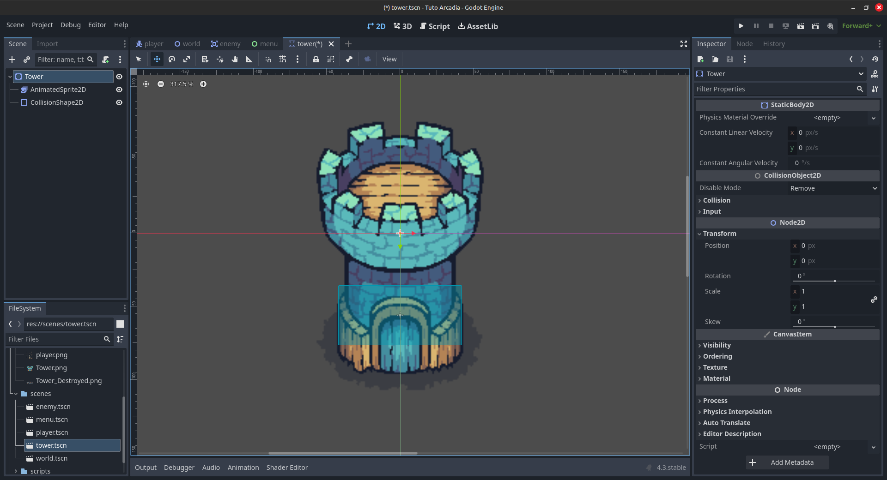
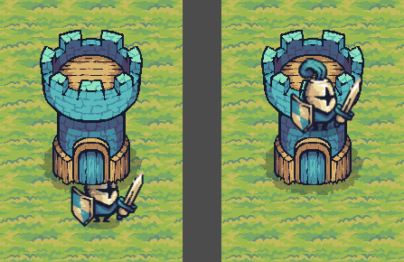
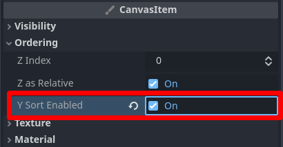
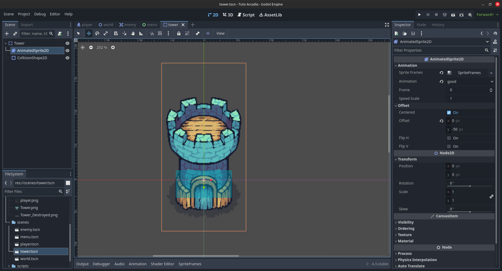
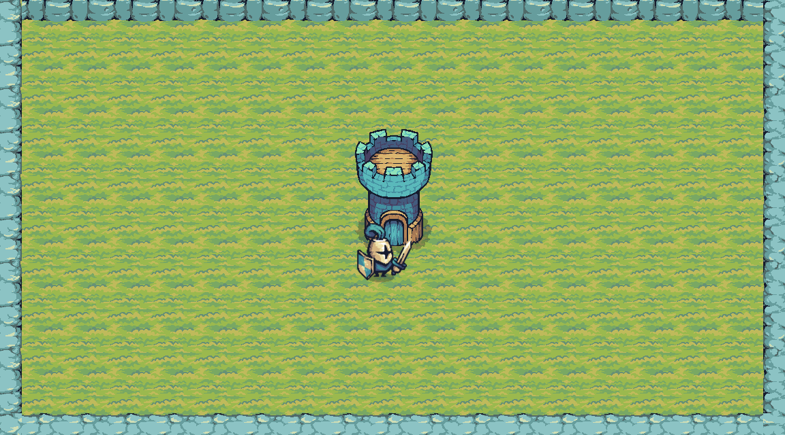

Création de la tour
===================

Initialisation de la tour
-------------------------

Pour l'instant, on a donc un monde avec un petit joueur qui peut se déplacer dedans.
Cependant, le joueur n'a pas grand chose à faire puisqu'il est tout seul dans ce petit monde.

Si on reprend le gif de présentation:

.. image:: img/preview.gif

Dans cette partie, on va créer la tour au milieu du monde.
Pour ce faire, vous aurez besoin de créer une nouvelle scène, qui soit un ``StaticBody2D``.

.. note::
    Les nœuds ``StaticBody2D`` sont utilisés pour représenter des objets solides (avec lesquels on veut collider) et immobiles.
    Concrètement, c'est très utile pour les murs, les sols, etc.
    Ici, la tour est immobile, et on ne veut pas que le joueur puisse la traverser, donc un ``StaticBody2D`` est parfait.

Comme pour notre player, il faut lui rajouter une ``CollisionShape2D`` et un ``AnimatedSprite2D``.

Rajoutez un ``SpriteFrames`` à l'``AnimatedSprite2D`` dans l'Inspecteur.
Ajoutez deux animations: ``"alive"`` et ``"dead"``.
Dans notre jeu, la tour a deux états: elle est vivante la majorité du temps, et elle est morte lorsque suffisamment d'ennemis l'ont touchée.
Dans l'animation ``"alive"``, cliquez sur **Add frame from file** (ou ``Ctrl+O``) et ajoutez le fichier ``assets/Tower.png``.
De même, dans l'animation ``"dead"`` ajoutez ``assets/Tower_Destroyed.png``.

Pour la collision, rajoutez un ``RectangleShape2D`` ou un ``CapsuleShape2D``.
Ne recouvrez pas toute la surface de la tour cependant, car on souhaite que le joueur puisse passer derrière la tour.
Pour ça, mettez la shape uniquement sur la base de la tour, comme ceci:

Script
------

Initialisation
~~~~~~~~~~~~~~

Ok. Maintenant, on va rajouter un script à notre tour.
On le verra plus précisément quand on fera les ennemis, mais la tour peut se prendre des dégâts.
Il faut donc garder un œil sur sa vie.
Ajoutez-donc un script au nœud ``Tower``.

On va avoir deux fonctions: la fonction ``_ready()``, qui est une fonction de base de Godot, et qui est appelée dès qu'un nœud apparaît dans la scène.
Et la fonction ``damage()``, que l'on va créer nous même, qui sera appelée à chaque fois que la tour se fera frapper.

On a donc quelque chose comme ça:

.. code-block:: gdscript

    extends StaticBody2D

    func _ready() -> void:
        pass # pass est utilisé pour ne pas faire d'erreur quand on n'a rien dans le code
    
    func damage() -> void:
        pass

On va ajouter quelques variables:

.. code-block:: gdscript

    # À mettre dans le corps du script, avant la fonction _ready()
    @export var max_health: int = 5
    var health: int

-   La variable ``max_health`` représente le nombre de PV (points de vie, ou HP en anglais) maximum de la tour, et aussi le nombre de PV avec lesquels la tour commence.
    Elle est en ``@export`` pour pouvoir facilement la changer depuis l'Inspecteur.
-   La variable ``health`` indique le nombre actuel de PV de la tour. C'est cette variable que l'on va décrémenter lorsque la tour prendra des dégâts.

Pour initialiser la tour, il nous faut donc mettre la variable ``health`` à la valeur de ``max_health``,
et aussi lancer l'animation ``"alive"`` de la tour, pour que l'on puisse voir la tour debout.
Dans la fonction ``_ready()``, ajoutez:

.. code-block:: gdscript

    func _ready():
        # La tour commence avec max_health PV
        health = max_health
        # La tour commence avec l'animation "alive", AKA la tour vivante
        $AnimatedSprite2D.animation = "alive"

Prise de dégâts
~~~~~~~~~~~~~~~

Pour la prise de dégâts, on va créer 2 signaux:

.. code-block:: gdscript

    signal is_hit(health_percent: float)
    signal is_dead()

-   Le signal ``is_hit`` sera appelé lorsque la tour se prendra des dégâts. Il prend en paramètre la variable ``health_percent``, qui représentera le pourcentage de vie restant à la tour.
    Ce pourcentage sera utile lorsque l'on affichera la vie de la tour, ce que l'on fera dans la dernière partie de ce tutoriel.
-   Le signal ``is_dead`` sera appelé lorsque la tour sera morte (quand ``health`` sera égale à 0). Il sera aussi utile pour pouvoir recommencer le jeu.

Il nous faut donc compléter la fonction ``damage()``. Cette fonction sera appelée par un ennemi dès lors que celui-ci touchera la tour.
Cette fonction doit faire:

-   Vérifier que la tour n'est pas déjà morte. Si c'est le cas, on peut s'arrêter là.
-   Décrémenter la vie
-   Vérifier si la vie est maintenant égale à 0.
-   Si oui, dire que la tour est morte et jouer l'animation de mort

Voilà donc le script pour faire tout ça:

.. code-block:: gdscript

    func damage():
        # Vérifier que la tour n'est pas déjà morte
        if (health <= 0):
            return
        
        # Décrémenter la vie
        health-=1
        # On émet le signal is_hit. Le pourcentage de vie restant est health/max_health
        is_hit.emit(health/max_health)

        # Si la tour n'as plus de vie, on émet le signal de mort, et on change l'animation de la tour
        if (health == 0):
            is_dead.emit()
            $AnimatedSprite2D.animation = "dead"

Bon, on n'a pas vraiment de moyens de vérifier que tout fonctionne, parce qu'on a ni ennemi ni menu...
Avant de faire ça cependant, mettons la tour dans notre monde!

Mise dans le monde
------------------

Dans la scène du monde, ajoutez la tour, comme vous avez fait pour le joueur.
Positionnez la tour au milieu de la map, et faites attention à l'ordre des nœuds dans l'arborescence pour que la tour et le joueur soient bien affichés au dessus du tilemap.

En jouant, vous pourrez remarquer que l'affichage de la tour et du joueur n'est pas très cohérent.
Vous pourrez observer l'une ou l'autre des situations ci-dessous, selon que le joueur est en dessous de la tour dans l'arborescence (image de gauche) ou au dessus (image de droite).

Pour régler ce problème, on va activer la propriété **Y sort**.
Cela va permettre d'afficher les différents éléments du jeu selon leur position sur l'axe Y.
Les éléments les plus hauts seront affichés derrière (par exemple, si le joueur est plus haut que la tour, ça veut dire qu'il est derrière).
Et les élements les plus bas seront affichés devant.

Pour ça donc, activez **Y Sort Enabled** dans l'inspecteur sur les nœuds ``Player``, ``Tower``, et ``World``:

Si on active pas la propriété sur le nœud ``World``, ça ne fonctionnera pas sur ses nœuds enfants, c'est-à-dire le joueur et la tour, donc faites bien attention à l'activer.

Vous pouvez tester. C'est mieux, mais vous aurez quand même peut-être quelques soucis. Pour ça, on va changer la position de notre tour dans la scène ``tower.tscn``.

Dans l'Inspecteur de l'AnimatedSprite2D, changez l'offset, et mettez une valeur en Y comme -50. Cela va décaler visuellement le sprite de la tour vers le haut, sans changer sa position.
C'est ce qu'il nous faut, car le Y sort utilise la position des nœuds pour fonctionner. Donc si on n'avait juste changé la position vers le haut, ça n'aurait rien changé.

Décallez aussi la ``CollisionShape2D`` en conséquence, vous devriez obtenir un résultat similaire à celui-ci:

Voilà. Vous pouvez retester le jeu, et normalement ce problème devrait être réglé.
Si vous avez toujours des soucis, essayez de jouer un peu avec les valeurs de l'offset, la taille des collisions, etc.

Finalement, vous devriez avoir un monde comme celui-ci:

