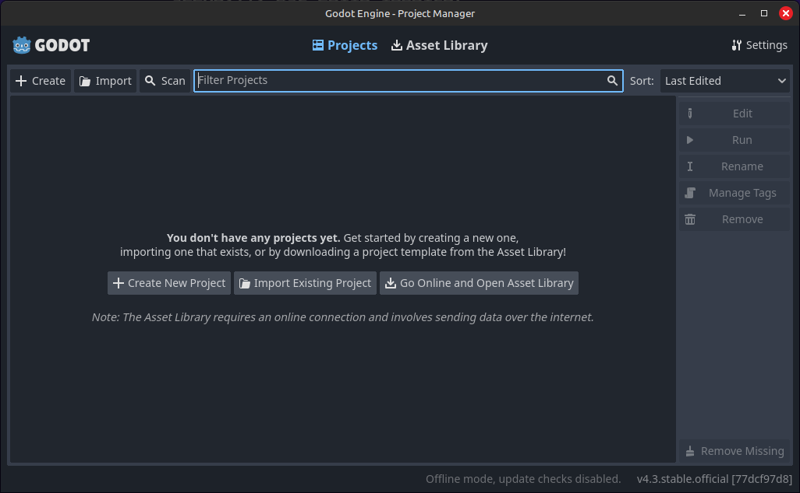
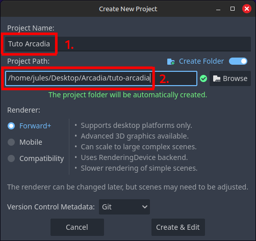
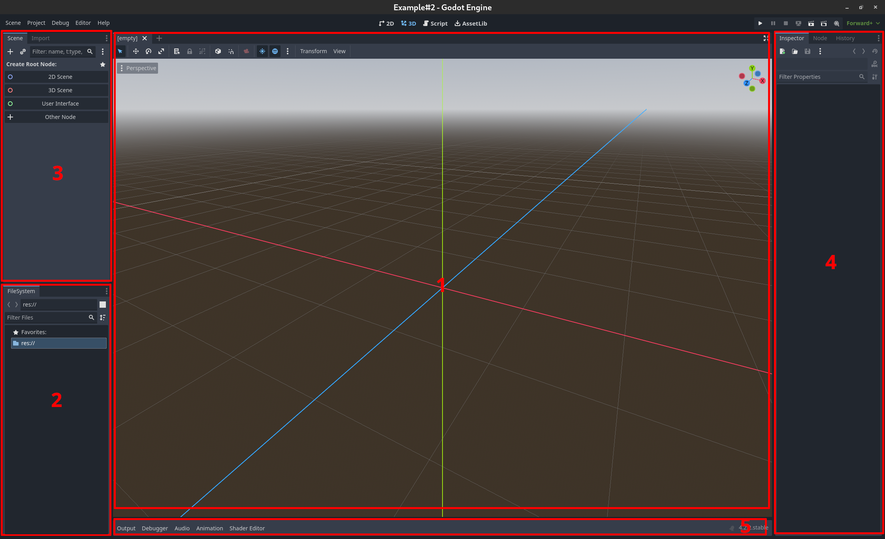
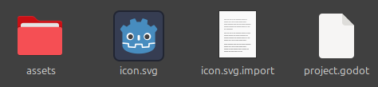

Découverte de Godot
=========

Dans cette partie du tutoriel, nous allons installer Godot, et créer notre projet.

Godot, c'est quoi?
------------

Godot Engine (prononcé *Godo* ou *Godote* ou comme vous voulez en fait) est un moteur de jeu open-source et gratuit très facile d'accès.
Godot permet de développer des jeux 2D et 3D grâce à une interface visuelle intuitive et un langage de script facile à apprendre, le *GDScript*, qui ressemble fortement à Python.
Godot est autant utilisé pour des petits jeux indépendants (comme nous!) que pour des jeux plus complexes (comme nous dans le futur, on l'espère!).

Godot fonctionne avec des scènes et des nœuds. On y reviendra un peu plus tard, mais un nœud, c'est un élément de base, qui compose vos scènes.
Vous pouvez faire interagir vos scènes entre elles (par exemple, mettre la scène *Joueur* dans la scène *Monde*).

.. installation-godot:

Installation de Godot
------------

Pour commencer le tutoriel, il vous faudra installer Godot. Pour cela, vous pouvez aller sur `ce site <https://godotengine.org/download/>`_ , pour y télécharger la dernière version de Godot.

.. note::
   Ce tutoriel a été écrit pour Godot 4.3. Ça ne devrait pas changer grand chose pour les futures versions, mais si vous voyez un problème, faites-le nous savoir!

Une fois le fichier .zip téléchargé et dézippé, vous pouvez lancer l’installeur, et après un peu d’attente, vous pourrez lancer Godot, et être accueilli par cette fenêtre:

Création de votre premier projet
------------

Cette fenêtre s'appelle le `Project Manager`. C'est ici que vous trouverez vos différents projets une fois que vous les aurez créés.
Actuellement, le `Project Manager` est vide, donc créons notre premier projet.

.. note::
   Pour ce tutoriel, certaines screenshots et termes que nous utiliserons seront en anglais.
   C'est généralement un meilleur choix de tout mettre en anglais lorsque l'on programme, et la documentation sur internet est plus fournie en anglais qu'en français.
   Libre à vous de mettre votre éditeur dans la langue de votre choix, mais il se peut que certains boutons n'aient pas les mêmes libellés chez vous.
   Vous pouvez changer la langue de l'éditeur dans les `Paramètres` en haut à droite du `Project Manager`, ou dans `Editor Settings` dans l'éditeur.

Cliquer sur le bouton **Create** en haut à gauche pour créer un nouveau projet.
Un popup s’ouvrira, en vous demandant des informations sur votre projet. Nommez votre projet ``Tuto Arcadia`` **[1]**, et choisissez le fichier dans lequel vous voulez qu’il soit stocké **[2]**.

Laissez les autres paramètres comme ils sont pour l'instant, et créez votre projet. Une nouvelle fenêtre devrait se lancer.
C'est la fenêtre principale de Godot, l'éditeur, celle où vous aller tout faire sur vos jeux.

L'éditeur
------------

Dans cette sous-partie, nous allons décrire les différents éléments qui composent l'éditeur:

[note: changer l'image pour inclure les nouveaux numéros]

1. Au milieu, vous trouverez la fenêtre principale de l'éditeur, celle-ci vous permettera de visionner, et de modifier les différentes scènes de votre projet.
2. En bas à gauche, vous trouverez l'*Arborescence du projet*. Il s'agit en réalité du dossier que vous venez de créer en créant le projet. Vous pouvez le retrouver sur votre ordinateur en suivant le chemin de votre projet (que vous avez rempli plus tôt).
3. Juste au dessus, en haut à gauche, on trouve l'*Arborescence des scènes*. Godot fonctionne d'une manière arborescente, c'est à dire que chaque élément, chaque personnage, etc... est un `nœud`, qui est le fils d'un autre `nœud`, et qui peut avoir des enfants. Ce fonctionnement est extrêmement puissant, et fait en sorte que, par exemple, un joueur n'est pas fonctionnellement différent d'un environnement.
4. A droite, on peut voir l'*Inspecteur*, c'est la partie de l'éditeur qui va vous permettre de modifier les différents paramètres du `nœud` actuel. On s'en servira très souvent.
5. En haut, vous trouverez les différents onglets. Actuellement, vous devriez être sur l'onglet *3D*, c'est celui qui est utilisé pour visualiser des scènes 3D. On ne s'en servira pas pour ce projet, qui sera entièrement en 2D (on utilisera donc l'onglet *2D*). Il y a aussi l'onglet *Script*, qui est l'endroit où on écrira tout notre code. Et l'onglet *AssetLib* qui ne nous servira pas pour l'instant mais où vous pouvez télécharger des assets que d'autres gens ont fait.
6. En haut à droite, vous trouverez différents boutons pour lancer votre projet. Voici les 3 plus importants:

   * *Triangle: (Raccourci-F5):* Lancer le projet (lance le jeu depuis l'écran titre, comme le ferait un joueur).
   * *Carré: (Raccourci-F8):* Arrêter le projet lorsqu'il est lancé (très utile!).
   * *Clap avec un petit triangle: (Raccourci-F6):* Lancer la scène en cours, très utile lorsqu'on veut débugger une scène sans vouloir forcément recommencer tout le jeu à chaque fois pour y accéder.

7. En haut à gauche, vous trouverez différents paramètres. L'onglet le plus important est **Project -> Project Settings**, où vous pourrez modifier les différents paramètres du projet (comme la taille de la fenêtre par exemple).
8. Et en bas, vous trouverez le reste des éditeurs. Tout ce qui n'est pas dans les autres points est en bas. Cela inclut par exemple, la fenêtre de débug, l'éditeur d'annimation, et l'éditeur de tilemaps.

Importer les assets
--------------

Après avoir créé le projet, il nous faut installer les différents `assets` que nous utiliseront pour ce tutoriel.

.. note::
   Un `asset` est le nom donné aux éléments d'un jeu vidéo (généralement non-code). Par exemple, une texture, un son, une font (police d'écriture), sont des assets (respectivement visuel, sonore, et re-visuel).

Pour cela, téléchargez le fichier :download:`ici <ressources/Godot-Cours-Arcadia---Tower-Protector--- Assets.zip>`, extrayez le fichier ``assets`` et mettez-le dans le dossier de votre projet.
Votre dossier de projet devrait contenir au moins les éléments suivants:

Une fois cette étape terminée, nous pouvons commencer à créer notre premier jeu! Cliquez sur le bouton *Suivant* pour continuer ce tutoriel!