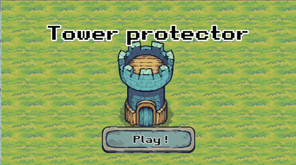

.. include:: ../README.rst

.. note::

   Ce tutoriel est en plein développement. Il ne couvre que jusqu'à la création du joueur.

Voici un petit sommaire de ce que ce tutoriel propose:

Contents
--------

.. toctree::
   :maxdepth: 1

   Accueil <self>
   Découverte de Godot <decouverte-godot>
   Création du Joueur <creation-joueur>
   Création du Monde <creation-monde>
   Création de la Tour <creation-tour>
   Création des Ennemis <creation-ennemis>

Pour démarrer l'aventure, cliques sur le bouton `Suivant` en bas à droite de cette page!