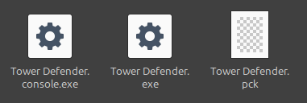

Petit coup de polish
====================

Dans cette partie bonus, on va régler quelques petits soucis qui n'affectent pas vraiment le jeu, et qui n'avaient pas vraiment leur place plus tôt dans le tutoriel.
Dans la partie sur la création du monde, on avait déjà évoqué la taille de la fenêtre.

Rendu des sprites
-----------------

Vous l'avez peut-être déjà remarqué, mais lorsque vous lancez le jeu, on dirait que les sprites sont flous.
Pourtant, lorsqu'on ouvre ces mêmes sprites dans un logiciel extérieur, on voit qu'ils sont bien nets.

En prenant par exemple le joueur:

Pour régler ça, en sélectionnant le nœud ``Player`` de la scène du joueur, changez le **Texture Filter** dans l'Inspecteur en **Nearest**:

Vous aurez tout de suite un rendu plus "crisp". Vous pouvez faire ça sur tous les nœuds qui en ont potentiellement besoin, comme l'ennemi ou la tour par exemple.
Mais vous pouvez aussi juste le faire sur les nœuds ``Menu`` de la scène ``Main`` et ``World`` de la scène... ``World``.

En effet, comme le **Texture Filter** est initialement sur **Inherits**, les nœuds enfant vont hériter leur valeur de **Texture Filter** de leur parent.
Ainsi, si le nœud racine d'une scène est en **Nearest**, et que tous les nœuds enfants sont en **Inherits**, alors tous les nœuds enfants appraîtront comme s'ils étaient en **Nearest**.

L'image du fond du menu sera toujours floue, mais c'est parce que l'image de base est floue.

Les contrôles
-------------

Deuxième petit coup de polish! C'est bien beau notre jeu là, mais qui joue avec les flèches directionnelles dans la vraie vie? Les personnes normales jouent en ZQSD!
En fait, on peut créer nos propres contrôles! Pour ça, allez dans **Project -> Project Settings**, puis dans l'onglet **Input Map**.

Si vous ne voyez rien, cochez l'option **Show Built-in Actions**. Là, vous verrez tous les contrôles disponibles de base dans Godot.

Si vous vous souvenez, pour les contrôles du joueur, on avait utilisé les inputs ``"ui_up"``, ``"ui_down"``, ``"ui_left"``, et ``"ui_right"``.
En scrollant un peu, vous pourrez voir que ces inputs sont activés, entre autres, lorsqu'on appuie sur les flèches directionnelles.
C'est pour ça que notre joueur répond lorsqu'on appuie.

Créons nos propres inputs! Déjà, décochez **Show Built-in Actions**. Dans la barre **Add New Action**, écrivez ``"MoveUp"`` et appuyez sur **Entrée**.
Votre input devrait apparaître dans la liste, sans rien d'autre.
Appuyez sur le petit **+** à droite pour ajouter une touche. Appuyez sur **Z** sur votre clavier, et cliquez sur **OK**.

.. image:: img/zinput.png

Faites de même pour ``"MoveDown"``, ``"MoveLeft"``, et ``"MoveRight"``:

Si vous voulez ajouter des contrôles manette, c'est aussi là que ça se passe, vous avez les options nécessaires lorsque vous ajoutez une nouvelle touche avec **+**.

C'est pas fini! Il faut maintenant changer les contrôles dans le script du joueur!
Pour faire ça, remplacer ``"ui_up"`` par ``"MoveUp"``, ``"ui_down"`` par ``"MoveDown"``, etc.

Vous pouvez maintenant vous déplacer avec ZQSD! Plus important encore, vous savez maintenant créer vos propres contrôles!

Lancement du jeu
----------------

Si vous avez suivi le tutoriel strictement sans sortir du chemin, lorsque vous appuyez sur le bouton **Lancer le projet**, en haut à droite, vous devriez avoir un popup:

Ici, cliquez sur **Select** et choisissez la scène ``main.tscn`` (ou cliquez sur **Select Current** si vous étiez déjà dessus).
En fait, c'est cette scène là qui va se lancer lorsque vous lancerez le jeu normalement (c'est la scène qui se lance pour les joueurs normaux). Jusqu'ici, on ne lançait que des scènes en particulier.

Si vous voulez changer la scène à lancer, vous pouvez aller dans **Project -> Project Settings -> Application -> Run**.

Icône du jeu
------------

Acutellement, lorsqu'on lance le jeu, l'icône dans la barre des tâches est juste la grosse tête de Godot. C'est beau, mais ça fait pas pro du tout.
Pour changer l'icône, allez dans **Project -> Project Settings -> Application -> Config**:

Vous pouvez mettre ce que vous voulez, mais il est conseillé de mettre une image à peu près carrée, et qui soit lisible en très petit.

Exporter son jeu
----------------

Bon. Vous venez de créer le jeu du siècle, mais si personne ne peut y jouer à par vous, c'est pas ouf. On va donc exporter le jeu!
Pour ça, allez dans **Project -> Export...**. En cliquant sur **Add...**, vous pouvez ajouter l'export sur l'OS de votre choix.
Pour l'exemple, on va prendre Windows, car c'est le plus répandu:

Templates
~~~~~~~~~

Vous aurez probablement plein d'erreurs un peu comme moi, pas forcément les même (je suis sur Linux).
Cliquons déjà sur **Manage Export Templates** en bas.
Ça nous ouvre une autre fenêtre, dans laquelle on peut télécharger des Export Templates (en gros c'est des trucs qui indiquent à Godot comment exporter correctement).

Laissez comme ça si vous savez pas trop quoi mettre, et cliquez sur **Download and Install**. Après un certain temps (ça peut durer longtemps selon votre connexion), la template est téléchargée.
Vous pouvez fermer cette fenêtre et revenir sur la fenêtre des Exports.

rcedit
~~~~~~

C'est cool, y a plus trop d'erreurs! L'erreur en jaune que vous pouvez voir concerne grossomodo l'icône du jeu.
Si vous voulez garder l'icône de base de Godot, vous pouvez passer cette étape. Sinon, allez dans **Editor Settings -> Export -> Windows**.

Là, il vous faudra installer rcedit `ici <https://github.com/electron/rcedit/releases>`_. Scrollez un peu et cliquez sur la build qui vous concerne (le plus souvent, rcedit-x64.exe):

Enregistrez le fichier et mettez-le quelque part sur votre ordinateur, personnellement je le met à côté de là où j'ai installé Godot pour pas le perdre.
Pas besoin de le mettre dans le dossier du projet, car c'est quelque chose que vous utiliserez pour tous vos projets.

Une fois installé, dans la fenêtre **Editor Settings** précédemment ouverte, renseignez le lien vers l'éxécutable que vous venez d'installer.

En revenant sur la fenêtre d'Export, plus d'erreurs!!

Finitions
~~~~~~~~~

Normalement, si vous avez déjà fait ces deux étapes une fois, vous n'aurez plus à les refaire pour vos prochains projets (ou peut-être renseigner le chemin vers rcedit).

Vous pouvez alors renseigner le nom du jeu: **Tower Defender**, ainsi que le chemin de l'export (là où l'export va se trouver sur votre PC).
Je vous conseille de créer un dossier Exports juste en dehors de votre projet pour faire tout ça. Vous pouvez faire plusieurs sous-dossiers pour les différents OS.

Enfin, appuyez sur **Export Project...**, et normalement c'est bon!
Vous pouvez aller dans le répertoire de l'Export, vous verrez normalement les fichiers suivants:

Pour l'envoyer à vos amis ou l'uploader sur itch.io par exemple, vous pouvez zipper tout ça ensemble, et envoyer le fichier compressé.

Fin
---

C'est la fin de ce tutoriel (pour de vrai cette fois). Si vous avez des problèmes, des questions, des recommandations, que vous avez vu une faute quelque part (même minime),
faites-le nous savoir sur le serveur discord d'Arcadia!

La prochaine étape maintenant, c'est de vous faire plaisir et d'ajouter plein de trucs par vous même!
Vous pourriez par exemple ajouter un compteur de score, qui indique combien d'ennemis vous avez tué. Un système de vagues de plus en plus difficiles.
Des nouveaux ennemis, des boss, qui sait. Bref, amusez vous!